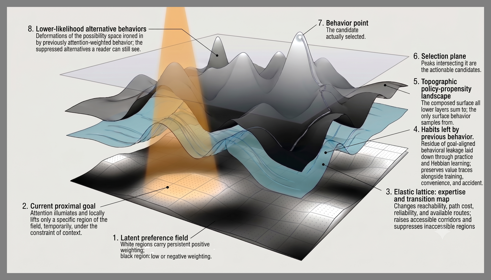

  

  ◯ <a href="https://github.com/EmotiveAutomaton/ghost-scale-sim">Ghost text</a>, all of it.

# Sounding Line

**An instrument for reading intent out of real artifacts.**

A sounding line is a weighted cord lowered into water to find the bottom, the oldest depth
instrument there is. It returns a reading when there is a bottom, and runs out of line when there
is none. "To sound someone out" means to probe for their intentions.

> ### ⚠ Work in progress
>
> This is an active research repository, and for now it is largely an engineering space: runners,
> queues, controls, corpora, and the record of what each experiment returned. Findings are
> provisional. Measures get rebuilt when they fail, several central measures have already been
> shown unable to do what they were built to do, and the record keeps those failures visible on
> purpose. Nothing here should be used to judge a real person's work.

---

## What it measures

**Depth: how many of a maker's decisions are recoverable from what they made.**

Everything else in the repository serves that measurement.

It is not an AI detector. A detector claims *a machine wrote this*. This instrument claims *this
much was decided here, and this is the evidence*. That claim is about the artifact, the maker can
rebut it, and being wrong about it is an ordinary disagreement.

Two consequences follow. Firing on hurried human work is the measurement working, because fast
human work contains fewer recoverable decisions. And writing "more like a human" cannot evade it,
because making more decisions for more reasons is the quantity being measured.

---

## Why the obvious build fails

Point a language model at a page and ask why it was made. This fails, and the failure is
structural. An unbounded reader asked an open question will produce a coherent answer for
anything, including sludge, so free-form intent attribution amounts to confident fabrication with
good grammar.

Machine content makes the problem concrete. It is goal-foreign: a real generating process
expressed in a vocabulary the reader has no entry for. The wall is non-invertibility: many maker
states map to one fluent surface, so the surface stays familiar while the state behind it stays
unrecoverable. Human makers are recoverable because the human solution space is bounded, by
architecture, by embodiment, by metabolic cost, by having to choose one thing because doing both
was too expensive.

So the probe imposes a bounded, human-shaped hypothesis family and measures fit inside it. The
boundedness is the mechanism.

---

## Status, 2026-08-12

Ninety-odd findings entries across four gates, three simulation batches, eleven model families,
and three publication recreations. The record keeps failures beside survivors.

### What has survived its controls

| | |
|---|---|
| **The flagship, under a fair induction control** | The first induction control's regressors contained the dose it claimed to remove (L22). With the dose arithmetically removed, the effect survives on all three independently generated corpora and gets stronger, and three published linguistic features it had killed revive the same way, nine of nine tests (L23, L24). What this measures is response to specified constraint dose within one generator. Whether it touches human intent, depth, or decisions is what the current program tests |
| **The per-block dose correlation** | Correlation between a prompt's specified constraint dose and the reader's affective signal, computed block by block. 25 runs across 11 model families, 18 survive. The no-maker control, re-adjudicated after an audit found its verdict gate could not fail (L26), fires at the rate luck supplies overall but concentrates in the flagship family. The permutation test could not distinguish leak from luck (L40), so that concentration stands as an open liability |
| **Function words against specified dose** | Closed-class word rates classify which rung an artifact came from at 1.6× to 3.0× chance, scaling with dose, with no model involved. The separation survives the fair induction control on the two strongest corpora and collapses on the weakest (L94). Specification recovery, which once corroborated this through a second channel, turned out to be carried by lexical echo (L36) |
| **Affect directions are real** | Four times chance on held-out sentences, while a word-counting model scored exactly chance |
| **Authorship as a calibration** | 7.6× chance, identical at all four scrambling granularities, which proves the scrambling code correct before any real number is computed |

### What failed

Every measure that reads the artifact has died, to length, then register, then vocabulary, in
that order. (Dated correction, 2026-08-08: the final three kills belonged to the broken control,
and all three features revive under the fair control on all three ladders, L24. The deaths to
length and register stand.) Decision density was word count, then vocabulary diversity. Of 342
published linguistic features, 61 of the 81 that replicated were machine detectors; the three
survivors were then killed and later revived by the control history above.

The block profile is a fact about the model. It is identical between intent-laden text and text
with no maker at all, in every one of eleven model families, with the peak landing anywhere from
block 2 to block 47. The bimodal profile this project once reported was a two-model artifact.

Gate 3, the primary for a month, is void for two independent reasons. Its statistic reads a large
positive where the truth is zero, and 76 features separate its two halves, so almost any measure
would.

### Six criteria that could not do their own job

This failure class recurs, and catching it is worth more than any single result.

    the unlock statistic          read a large positive where the ground truth was zero
    parallel analysis             returned 335 components on pure Gaussian noise
    the ladder's length ceiling   voided the founding question on a rank correlation over a
                                  4% length difference
    the induction control         its regressors contained the dose -- what it "controlled
                                  away" was the treatment itself
    the no-maker verdict gate     required abs(nan) > 0.2 -- DEAD was the only reachable
                                  verdict, under any data whatsoever (audit L26)
    the affect shuffle gate       its pass threshold sat below the statistic's arithmetic
                                  floor in every recorded run (audit L26)

A standing rule now covers the class: run every measure on data whose answer you already know,
before running it on data whose answer you don't.

### The binding constraint

The binding constraint is a corpus: one maker across different kinds of artifact, where register,
audience, and purpose vary while the maker holds still. Depth as a relation to a domain needs it;
the polish-variation claim needs it; values needing many works needs it.

Such corpora are rare. The cross-genre authorship literature describes its own data as *"scarce
and very limited in size"*, and most corpora carrying a "cross-domain" label vary topic
underneath. PAN's cross-domain tasks are all fan fiction, varying fandom. The program leads this
thread with a small commissioned pilot.

---

## What is being built now

One human read fifteen artifacts aloud, blind, in plain text. That produced more usable design
than three gates. Reading starts at an anomaly, the loop runs both ways, and *"depth is a
property of the writer with respect to the domain"*, which makes depth a relation and makes the
missing corpus fatal: a relation cannot be measured by varying one side.

Those readings are the richest hypothesis source the project has. No independent ground truth has
scored them, so the most generative evidence in the project has a sample size of one reader and
is treated accordingly.

### The proximal goals

The unit of analysis is changing. The program stops searching for a scalar that correlates with
"depth" and starts validating recovery of individual, independently recorded choices. A decision
event carries its target, the alternatives that were available, the choice made, its
dependencies, and its context. For each event the question is whether the finished artifact lets
a bounded reader recover the actual choice better than context alone and better than matched
false alternatives. Once that works, recovered events get summarized as amount, breadth, and
integration, with calibration reported separately. The denominator is declared choice
opportunities or revision events; per-word density recreates the length trap.

1. **Turn the revision corpus into a choice-recovery study.** Each labelled revision is an event
   with a recorded purpose. The reader picks the actual purpose from a bounded candidate set,
   scored against the brief alone, shuffled labels, unchanged passages, and matched decoys, split
   by author. The pilot and its matching controls have run: the recovery margin survives
   covariate matching at reduced size (L65, L73), and the matched control collapsed "content"
   identifiability on its own covariates (L66).
2. **Replace the ladder with a factorial benchmark** crossing target (surface against
   problem-directed), amount, coupling, and realization, so the dose-responsive quantities face a
   real construct test.
3. **Validate estimators where ground truth exists.** The parent simulation runs the estimator
   tournament with exact inference first and reports a failure-boundary map.
4. **Keep validating our own instruments first.** The audit record above is why.

The nearest defensible public result is narrow. Given a fixed brief and a held-out human author,
the finished artifact allowed a bounded reader to recover specified problem-directed revision
purposes above matched alternatives, beyond what the brief and surface changes supplied. That is
the target claim, and it justifies the work downstream.

### The theory, in five files

[`docs/theory/`](docs/theory/) is the hypothesis store, holding every claim, its status, and what
would test it. More than 130 numbered hypotheses, each carrying whether it was checked on real
text, in the parent simulation, or against published work. Each file owns one question:

| | |
|---|---|
| **the triple inference** | *what is inferred*. Three target families at different timescales (proximal goal, process, persistent motivational organization), their dependencies, and what makes values identifiable at all |
| **three cognitive layers** | *what architecture might support the inference*. The affective-machinery claim, its evidence in eleven model families, and the build gates |
| **decision traces** | *what observable traces decisions leave*. Target × control × terminal topology as independent axes of every trace, with polish splitting into attraction and translation |
| **reader heuristics** | *how a bounded reader finds and combines those traces*. Priors, entry cues, traversal, calibration, and an instrument panel recording what each heuristic is measured to be worth |
| **alignment** | *what objective should govern a system that can read them*. The terminal value as the balanced sum of seeking and acting. Formally dormant, a boundary specification with a written wake condition |

  

  The curator's visual map of the forward model: values, attention, expertise, and habit
  composing into the surface a behavior is selected from. The reader's problem, and this
  project's, is inverting it from the selected point back down. The diagram is notional: it
  states the hypothesis, and none of its geometry comes from data.

---
## Repository

| | |
|---|---|
| [`SOUNDING_LINE_SPEC.md`](SOUNDING_LINE_SPEC.md) | written before any code, hash-locked, never edited |
| [`docs/theory/`](docs/theory/) | the hypothesis store, every claim, its status, and what would test it |
| [`FINDINGS.md`](FINDINGS.md) | the method archive, how each test was run |
| [`TODO.md`](TODO.md) | what has not been run, under the same identifiers as the theory |
| [`docs/TOOLS.md`](docs/TOOLS.md) | installed libraries and the built-here instrument ledger, each with its validation state |
| [`docs/method/`](docs/method/) | lessons, what a control licenses, deviations, literature reviews |
| [`docs/sim/`](docs/sim/) | traffic with the parent simulation, both directions |
| [`docs/gates/README.md`](docs/gates/README.md) | instrument gates vs claim gates |
| [`soundingline/family/`](soundingline/family/) | the hypothesis family as data files, arguable without reading Python |
| [`soundingline/probe/`](soundingline/probe/) | prompts (locked), schema, two arms |
| [`soundingline/measures/`](soundingline/measures/) | fit, unlock, gated unlock, position |
| [`prereg/`](prereg/) | the cards, locked before each run |
| [`results/readings/`](results/readings/) | human reading sessions, and a provenance ledger |
| [`fetch/`](fetch/) | corpus acquisition, importing nothing from the analysis package by design |
| [`runners/`](runners/) | one file per experiment, each opening with its own pre-registration |
| [`run_first_gear.sh`](run_first_gear.sh) · [`run_second_gear.sh`](run_second_gear.sh) | the queue engines: first gear runs one job at a time and leaves the GPU alone; second gear uses the whole machine |

---

## Lineage

Direct offshoot of the [Ghost Scale Simulation](https://github.com/EmotiveAutomaton/ghost-scale-sim),
a simulation of what happens to a reader who can no longer tell whether there is a mind behind
what they are reading. That project established the mechanisms; this one asks whether they can be
measured on real things.

Underlying theory: [Art: A Unifying Model](https://abrahamhaskins.org/art), art as compressed
intent, appreciation as inverse reinforcement learning.

**Prior art.** The inversion this project performs is Bayesian Theory of Mind / inverse planning
(Baker, Saxe & Tenenbaum). The parent simulation constructed it independently for a different
domain. The new part here is running the inversion over artifacts, where the trajectory is
already gone; we have not found prior work that does this.

---

## Cautions

The instrument may not claim that a machine wrote something. It may not quote any one of its
quantities alone. It may not read low depth as low value: low depth means few decisions are
recoverable, which is a claim about the artifact and the reader jointly.

One curator, one model, English only, a corpus biased by which sites permit crawling. No claim
about prevalence, and none about any individual.

**MIT licensed. Read the deviations before quoting a number.**
