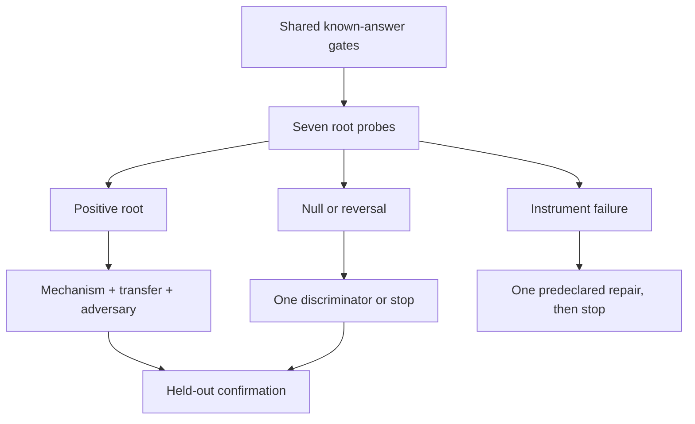

# Sounding Line Phase 2.3: Adaptive Process-Inversion Program

**Status:** Operative coding-agent work package

**Curator:** Abraham Haskins

**Prepared:** 2026-08-21

**Repository snapshot inspected:** `96a8b3c6` (`main`, 2026-08-19 local clone)

**Phase relationship:** Phase 2.3 expands the process-inference half of Phase 2.2 into a tree of exploratory, discriminating, and confirmatory tests

**Artifact status:** This is a design context, not a sixth theory document. If retained in the repository, its canonical destination is `docs/design/PHASE_2_3_CONTEXT.md`.

---

## 0. What this package is for

Phase 2.3 should run long enough to reveal which version of the process-inversion theory is actually surviving. It must not become a flat accumulation of anomaly studies or a new provenance detector disguised in theory language.

The coding agent's task is to build a **shared known-answer substrate**, run a **cheap root test in each theoretical wing**, and follow only the branches that the early results authorize. Every root result should make at least one possible world less plausible. Every branch should have been declared before the root result is seen.

The phase is designed to answer this question:

> **Can a bounded reader use an artifact, declared context, and a human-coherent generative prior to recover useful structure about the process that made the artifact—while distinguishing actual-process evidence, reader-enactable reconstruction, interaction control, and fluent projection?**

The intended product is a map of where process inversion works, where it reduces to useful reenactment, where it requires process records, and where the reader is merely telling a persuasive story.

This package does **not** ask the coding agent to settle the theory in advance. It gives the theory multiple places to fail cleanly.

---

## 1. Authority and reload order

Before implementing Phase 2.3:

1. Resolve the current default-branch commit. The inspected baseline is `96a8b3c6`; if the repository has advanced, reconcile this package with the newer state rather than reverting it.
2. Read the whole of `docs/theory/`, newest first, including `docs/theory/README.md`.
3. Read the folded end states in `FINDINGS.md`, then `docs/STATE.md`, the live Phase 2 tables in `TODO.md`, and the current evaluation contract.
4. Read `SOUNDING_LINE_PHASE_2_2_CONTEXT.md` and `SOUNDING_LINE_PHASE_2_2_THEORY_ERRATA.md`, or their repository copies if already landed.
5. Inspect `docs/assets/visual-map.png` directly. The trajectory geometry remains the binding mental model.
6. Read the matching sections of `docs/method/LESSONS.md` and `docs/method/CONTROLS.md` before each design becomes a runner.
7. Reuse existing corpora, schemas, and result machinery wherever their chain of custody remains valid.

Authority order:

1. The curator's explicit rulings, including the corrections in §2.
2. The five living theory files as reconciled with ratified errata.
3. Validated repository results in their latest folded state.
4. This work package.
5. External literature and implementation convenience.

Standing constraints:

- Preserve the five-file theory architecture.
- Do not create a new theory file.
- Do not edit curator blockquotes except on explicit instruction.
- No subagents unless the curator explicitly requests them.
- No material spend or cloud burst without the repository's existing approval conditions.
- Do not wake the value-extraction or alignment program.
- Do not infer model internals from model prose or hidden-reasoning length.
- Do not resume detector stacking merely because one process field looks promising.

### 1.1 Current empirical starting point

The inspected repository does not yet contain Phase 2.2 as a landed program. Its current folded results impose these boundaries on Phase 2.3:

| Existing result | What survives | Phase 2.3 consequence |
|---|---|---|
| **G129 choice recovery** | Recorded revision purpose is recoverable from the delta: 0.4854 against a 0.25 analytic floor; the matched arm holds at 0.4148. The 19-feature change block wins the instrument contest at 0.5552. | Choice recoverability is real on one revision corpus. The model reader is not automatically the best instrument. Reuse the block as a baseline and do not call this general process inversion. |
| **G131 factorial corpus** | 180 artifacts are complete across two local families; target, amount, coupling, and realization ground truth exists. Generation seed provenance has a documented limitation and a fixed future path. | Build the already-owed recovery study first where it supplies a Phase 2.3 root; do not regenerate the corpus or erase the determinism note. |
| **G149 shift sampler** | The explicit gridworld ruler finds planted switches at 89.5%; the surface-distance text port finds 0 of 12. | Likelihood-grade evidence is licensed in construction. Surface window distance is dead and must not be revived under a new name. |
| **G153 pilot** | 240 process-recorded local-model artifacts exist, but a 49-feature surface reference reads provenance at 0.9785 because human and model cells are badly unmatched. | Reuse process records for within-construction tests. Do not treat the corpus as a meaningful provenance benchmark until matching is repaired. |
| **L136 methods audit** | Nine of eleven artifacts were clean; the G131 seed defect was found and documented; the G149 text null survived three statistic forms. | Preserve the DESIGN CHECK, manifest, fixed-label, and audit discipline. The text-sampler null is stronger, not an invitation to tune it. |
| **G152 evaluation contract** | The live clone still carries a draft binary policy awaiting adjudication. Phase 2.2 supersedes that ontology with a reconstruction profile. | Reconcile this conflict before freezing any Phase 2.3 output. Binary policy may remain at a later product layer only. |

Phase 2.3 begins from **one bounded choice-recovery positive, one constructed-world sampler positive, one text-sampler null, and several useful process records**. It does not begin from a validated artifact-only process reader.

---

## 2. Curator rulings that bind Phase 2.3

### 2.1 Failure to notice

For this phase, use the following operational ruling:

> **If the relevant feature was perceptually available, failure to notice it is one decision at the episode resolution. Physical or perceptual inability to receive the feature is a separate exception. Divided attention, exhaustion, and absent expertise are context, not additional decisions.**

The process record must therefore distinguish:

1. **Perceptual access failure:** the maker could not receive the relevant evidence through the available sensory or technical channel. Do not code this as a decision.
2. **Available but not noticed:** one non-recognition decision event at the resolution used by this project.
3. **Noticed:** recognition occurred; later handling is separately coded.
4. **Unknown:** the process record cannot establish access or awareness.

The curator's further ruling is that, when perceptual access exists, non-recognition or non-repair still serves at least one secondary goal, often conserving time, energy, money, attention, status, or convenience. Phase 2.3 should preserve that goal ontology without giving the instrument a free success:

> **Calling every omission “resource conservation” after the fact is not evidence.** A reader receives credit only if it distinguishes the operative secondary-goal family, ranks the recorded goal above matched alternatives, or constrains a later choice that the inferred tradeoff predicts.

This guardrail makes the claim empirical rather than tautological. The ontology may say a goal exists even when the artifact does not identify which goal it was. `secondary_goal_unknown` is therefore a valid and often correct output.

### 2.2 Ordered accidents

Ordered accidents are possible. Separate the origin of a perturbation from its later handling:

- an event may begin as physical, stochastic, or unintended;
- the maker may fail to notice it;
- the maker may notice and remove it;
- the maker may notice and conceal it;
- the maker may retain it for convenience;
- the maker may integrate it into later structure;
- the maker may deliberately create something that resembles an accident.

The strongest artifact evidence often concerns **integration**, not origin. Later structure can establish that a contingency became part of the operative trajectory without proving whether the first occurrence was accidental.

### 2.3 Context changes a generative distribution; it does not dictate a story

The low-quality-paint example is a probability reweighting, not a deterministic ladder:

> Material, biography, tool access, model family, commission, and constraint alter the reader's distribution over plausible processes. They do not license a fixed chain from one cue to poverty, loss, metaphor, or value.

Every context test must therefore report posterior movement, calibration, and artifact contribution. A context card that simply states the answer has failed.

### 2.4 Drives and expertise are deliberately deferred

The curator's current working model treats Pankseppian action/emotion channels as **evolutionarily supplied expertise**: resistant but adjustable solution paths for broad classes of problems. “Drive” may currently jingle-jangle at least two constructs:

1. an inherited action/emotion channel or pre-solved transition structure;
2. an earlier valence-assigning or need-setting quantity that may lie closer to values.

Phase 2.3 records this as an unresolved future distinction. It does not operationalize it, simulate it, or use it to interpret process results. The present phase tests the second inference—process—not the third inference—persistent motivational organization.

### 2.5 LLMs as partial human generative models

The project may test the functional claim that a language model supplies a useful human-shaped process prior because it was trained on human artifacts. It may not assert from definition alone that the model reproduces the human causal process.

The admissible claim form is:

> A self-enactment or candidate-generation step improves recovery of independently recorded human process facts beyond direct reading, context-only reading, and surface baselines.

If the gain appears only on the same model family that produced the artifacts, the result is family familiarity, not a human generative model.

### 2.6 Human invertibility remains a relation

Human invertibility belongs to the reader–artifact–context relation. A model can produce a highly human-invertible artifact, and a human can produce an artifact that a given reader cannot invert. Neither direction is provenance proof.

---

## 3. The Phase 2.3 target

### 3.1 Separate the historical and instrumental questions

Use these objects throughout the phase:

- \(P^\star\): the recorded process that actually produced the artifact, at the behavioral resolution the study can verify;
- \(\tilde P_R\): a route the reader could enact to produce the artifact under the stated conditions;
- \(q_R(P \mid O,C)\): the reader's distribution over plausible maker processes given artifact \(O\), context \(C\), and reader identity \(R\);
- \(N^\star\): the contribution and ratification network across participants and tools;
- \(H^\star\): the anomaly-handling trajectory;
- \(K_R\): the reader's relevant expertise and available process model.

The two primary questions are not interchangeable:

1. **Historical correspondence:** does the reading place probability on \(P^\star\) or its correct equivalence class?
2. **Instrumental reenactment:** does \(\tilde P_R\) actually let this reader reproduce the artifact or satisfy withheld constraints?

A reconstruction may be historically wrong and instrumentally useful. That outcome narrows the theory to reenactment; it does not count as historical process recovery.

### 3.2 The mixed-control object

Do not assign a single author-share scalar to a mixed artifact. Represent at least these contribution relations:

- **proposal:** who introduced a candidate;
- **recognition:** who identified its relevance or quality;
- **selection:** who accepted one candidate over alternatives;
- **veto:** who prevented an alternative from surviving;
- **integration:** who made the candidate cohere with the rest of the artifact;
- **repair:** who corrected or redirected it;
- **surface realization:** who supplied the surviving wording, mark, or execution;
- **downstream leverage:** which earlier choice reduced or redirected later work.

These can belong to different participants. The network, not token proportion, is the process object.

### 3.3 The observational-equivalence boundary

If two final artifacts and their declared contexts are identical for the same reader, their artifact-only readings must be identical:

\[
(O_1,C_1,R_1)=(O_2,C_2,R_2) \Rightarrow q_1=q_2.
\]

Exact-equivalence cases are a calibration test, not a challenge the reader should beat. The correct output is an equivalence class or uncertainty. Any artifact-only reader that distinguishes hidden histories in this condition is leaking metadata, using prohibited process information, or fabricating precision.

### 3.4 Required output profile

The Phase 2.3 reader must be able to emit:

```text
reading identity
    artifact, lineage, reader, reader family, prompt/configuration
    input interface: artifact-only / paired-delta / process-aware
    supplied context and its provenance

historical process posterior
    ranked process families or equivalence classes
    probability or calibrated score by candidate
    evidence and counterevidence
    assumptions needed
    abstention / underdetermination

reader-enactable route
    proposed reenactment route
    required expertise, tools, and context
    execution result if tested
    distinction from historical-process claim

contribution network
    proposal / recognition / selection / veto
    integration / repair / surface realization
    downstream leverage
    actor uncertainty

anomaly trajectory
    perceptual access: yes / no / unknown
    noticed: yes / no / unknown
    handling: repair / conceal / retain / exploit / none / unknown
    origin: planned / accidental / ordered-accident / unresolved
    secondary-goal candidates and uncertainty
    model-revision state: local exception / reader-model revision

validation
    context-only margin
    cheap-feature margin
    exact-equivalence behavior
    withheld-evidence result
    transfer result
    calibration and abstention

claim boundary
    reenactment supported or not
    recorded-process correspondence supported or not
    causal internals unavailable
    provenance not inferred
```

No field should be collapsed into “probability human,” “decision weight,” “percent authored,” or “soul.”

---

## 4. The rival world models

Phase 2.3 should leave the project closer to one of these pictures:

| World | What the reader is doing | Characteristic result pattern |
|---|---|---|
| **W1: bounded historical inversion** | Recovering real process classes from artifact traces under context | Actual-process recovery beats baselines, survives surface matching, transfers, and constrains withheld facts |
| **W2: useful reenactment** | Finding a human-coherent route that works without recovering the maker's history | Reproduction succeeds; actual histories remain equifinal or unrecoverable |
| **W3: context-conditioned projection** | Starting from self and moving mostly when biography or labels push it | Context changes answers, but artifact contribution and withheld-process recovery fail; false context steers equally well |
| **W4: process-aware audit only** | Recovering contribution and handling from deltas or logs, not from final artifacts | Paired-delta and process-aware arms pass; artifact-only arms abstain or fail |
| **W5: fluent rationalization** | Producing plausible stories with little constraint from evidence | High confidence, poor calibration, exact-equivalence violations, no held-out transfer |
| **W6: current instrument failure** | The theory may remain open, but the reader/ruler cannot measure it | Known-answer or no-signal gates fail before natural cases are interpretable |

The phase need not force one global answer. Different process fields may land in different worlds. Repair may be historically recoverable while origin remains reenactment-only; contribution may require deltas while context-conditioned expertise works artifact-only.

---

## 5. Adaptive program shape

The first wave runs one cheap root in every wing. The second wave follows only branches opened by those results.



The seven wings are:

1. self-anchor and context adjustment;
2. equifinality and reenactment;
3. ratification and mixed control;
4. anomalies, attention, and secondary goals;
5. expertise, tools, and reader mismatch;
6. ordered accidents and unexplained order;
7. the LLM generative-prior ablation.

The wings share data structures and controls but make different theoretical claims. Do not average them into one score.

---

## 6. Shared substrate before any wing branches

### 6.1 Reuse the evidence already paid for

Inventory and reuse, where valid:

- **G129 / ArgRewrite:** recorded revision purposes, paired deltas, no-op controls, matched alternatives, and the 19-feature change baseline;
- **G131 factorial corpus:** 180 artifacts crossing target, amount, coupling, and realization, with instruction ground truth and the recorded seed limitation already documented;
- **G149:** a known-answer shift-sampler ruler that passes in the gridworld and a surface-distance text form that is dead;
- **G153:** 240 process-recorded local-model artifacts across two model families, with lineage and generation manifests;
- **Ghost Scale Simulation:** mechanism questions with explicit agents and true latent states, accessed through the established interface rather than reimplemented here;
- **version histories and revision corpora:** paired-delta and process-aware material, never silently pooled with artifact-only data.

The first engineering task is a dependency table stating which Phase 2.3 roots can be answered from existing data and which require a new construction. Do not regenerate what already exists merely to conform to a new filename.

### 6.2 The process-record schema

Every constructed case needs an external behavioral record. Do not use a model's generated rationale or hidden chain of thought as ground truth.

Minimum case fields:

```text
case_id, lineage_id, domain, medium, brief_id
artifact_final, artifact_versions, declared_context
participant_ids and participant_types
tool/model versions and accessible capabilities
process_interface availability
candidate process families
exact-equivalence group, near-equivalence group
split, construction seed, manifest hash
```

Minimum event fields:

```text
event_id, parent_event_ids, order
actor_id
operation:
    propose / perceive / notice / select / reject / veto
    revise / integrate / repair / conceal / retain / exploit
    external_or_physical_perturbation
target span or artifact relation
primary_goal_id
secondary_goal_candidates
constraint_ids
counterfactual alternatives shown or available
visible_in_final_artifact: yes / partial / no
ground_truth_source
```

Special handling for non-recognition:

- if `perceptual_access = false`, do not create a decision event for failure to notice;
- if `perceptual_access = true` and a process record establishes non-recognition, create exactly one `notice = false` event at episode resolution;
- record exhaustion, divided attention, expertise, deadline, and resource pressure as context fields;
- do not infer the secondary goal from context alone unless the construction records it.

### 6.3 Three interfaces remain separate

1. **Artifact-only:** final artifact plus declared context permitted by the condition.
2. **Paired-delta:** before/after or candidate/selected pair.
3. **Process-aware:** prompts, revisions, interaction logs, or explicit event records.

Every metric, report, and model field declares its interface. A process-aware success cannot migrate into an artifact-only claim.

### 6.4 Reader arms shared across wings

At minimum, compare:

1. **direct reader:** infer process without an explicit self-enactment stage;
2. **self-route reader:** first generate how it would make the artifact, then adjust toward the maker;
3. **candidate-and-discriminate reader:** generate several process candidates, then rank them against the artifact;
4. **context-only reader:** sees the context and candidate set without the artifact;
5. **artifact cheap baseline:** lexical, semantic, and change features appropriate to the interface;
6. **surface-matched baseline:** strongest available non-process classifier on the constructed set;
7. **process-aware ceiling:** sees the permitted record and establishes whether the target is answerable at all.

Use at least two reader families before making a reader-general claim. Same-family model readers and generators are a diagnostic slice, not the default evidence.

### 6.5 Common gates

Every root carries a `DESIGN CHECK` block with the null expectation, alternative expectation, failure direction, and exhaustive outcome bands. At minimum:

1. **No-signal:** no event, no anomaly, or no recoverable distinction produces abstention or the analytic floor.
2. **Known-answer:** the reader can recover easy planted cases before natural ambiguity is interpreted.
3. **Exact-equivalence:** identical observable inputs receive identical distributions within numerical tolerance.
4. **Artifact contribution:** full reader beats context-only.
5. **Cheap-feature:** the process reader must add something beyond the strongest simple block, or concede that the block is the better instrument.
6. **Negative-heavy:** ignored, absent, decoy, and false-mistake cases are common enough to expose yes-machine behavior.
7. **Calibration:** probability and abstention are scored, not merely accuracy.
8. **Interface:** artifact-only, paired-delta, and process-aware results are never pooled.
9. **Withheld evidence:** the reconstruction constrains something that did not build it.
10. **Reader transfer:** reader-specific effects are labeled; generator-family familiarity is measured.
11. **Context integrity:** context does not state the answer and true context outperforms a plausible false-context control.
12. **Multiplicity and specification:** all root families are declared before the first root is scored; discovery and confirmation splits stay separate.

### 6.6 Shared outcome vocabulary

Each root ends in exactly one state:

- **ROOT-POSITIVE:** the exploratory effect points the declared direction, clears the practical discovery band, and passes its ruler and principal control;
- **ROOT-NULL:** the ceiling and ruler pass, but the effect lies in the practical-null band;
- **ROOT-REVERSED:** the result supports the named rival direction;
- **ROOT-AMBIGUOUS:** interval or gate lands between declared bands;
- **INSTRUMENT-FAIL:** the known-answer, no-signal, leakage, or interface gate fails.

These states route work; they are not confirmatory evidence.

---

## 7. Branching discipline

### 7.1 Positive roots

A positive root opens exactly three default branches:

1. **Mechanism discriminator:** distinguish the favored explanation from its closest rival.
2. **Transfer:** change reader family, generator family, domain, medium, or context.
3. **Adversarial case:** construct the easiest way the apparent signal could be faked.

At least one of those runs on untouched data. A root that survives only one favorable construction does not proceed to detector use.

### 7.2 Null roots

A null with a passed ceiling opens at most one discriminating follow-up. The follow-up must have been named before the root ran and must test either:

- a resolution mismatch;
- an interface boundary;
- a specific theoretically predicted interaction hidden by the aggregate.

If that follow-up is null, stop the wing and narrow the claim. Do not respond with an unbounded prompt search.

### 7.3 Reversals

A reversal takes priority over ordinary positives. Before running more data, write the rival account in plain language and specify one case where the curator's model and the rival diverge.

### 7.4 Ambiguous results

Freeze the design and either power one held-out continuation or stop. Do not tune the statistic on the ambiguous sample.

### 7.5 Instrument failures

Each root may name one repair before it runs. If the repair also fails its ruler, retire the instrument family for this phase. A failed instrument is not evidence against the theory, but it is a reason to stop spending on that route.

### 7.6 Discovery and confirmation

There is no universal sample size. Every root derives a power or precision target appropriate to its statistic before running. The early map may use existing cases and small matched constructions, but it only routes branches. Confirmatory claims require:

- untouched cases;
- frozen reader and statistic;
- 95% intervals or the repository's stronger established rule;
- family-wise handling of the declared root family;
- all seeds and exclusions reported;
- no test-set threshold tuning.

Cap the first new-generation wave to what fits in one ordinary local queue day. A root that requires human labor, paid APIs, or cloud compute waits behind a positive cheap construction.

---

## 8. Wing A — self-anchor and context adjustment

### A0. Root question

> Does a reader begin from a self-enactable route and adjust toward the maker in a way that improves recovery of recorded process, or does context merely steer a plausible story?

### A0 construction

Build matched process packs with:

- one artifact;
- at least two plausible production routes;
- a recorded actual route;
- a true context card that changes route feasibility without naming the route;
- a plausible false context card;
- an irrelevant context card;
- a context-only arm;
- separate implicit and explicitly elicited self-route reader arms.

Where feasible, cross maker–reader similarity and familiarity:

- same model family / different family;
- same domain competence / unfamiliar domain;
- known prior artifacts / no prior artifacts.

Do not elicit a self route and then treat the induced anchor as proof that an implicit anchor existed. The elicited and unelicited arms are separate.

### A0 primary measures

- log score or Brier score on the actual process family;
- top-k coverage of the correct equivalence class;
- movement from artifact-only to true-context posterior;
- movement under false and irrelevant context;
- artifact contribution over context-only;
- withheld process-fact recovery;
- overconfidence and abstention;
- distance between inferred maker route and separately elicited self route.

### A0 routing

| Root pattern | Interpretation | Branch opened |
|---|---|---|
| true context improves actual-process recovery beyond both artifact-only and context-only | context conditions a real artifact inference | **A1 minimum-sufficient context**, **A2 similarity/familiarity**, **A3 false-biography adversary** |
| true context changes confidence but not accuracy | context calibrates but does not identify process | **A4 calibration-only transfer** |
| true and false context steer equally | suggestion or prior overwrite | **A5 evidence-conflict test**, then stop if repeated |
| explicit self-route improves withheld recovery | self-enactment is a useful solver | **A6 implicit-versus-explicit transfer** |
| explicit self-route improves plausibility but not withheld recovery | rationalization from self | route toward W3/W5; no self-route expansion |
| no context or self-route effect with ceiling passed | current reader does not use the proposed route | one predeclared higher-resolution case, then stop |

### A branches

**A1 — minimum-sufficient context.** Remove context fields one at a time and test whether tools, material, biography, constraint, or prior work supplies the actual adjustment. This is probabilistic reweighting; no single field is assumed causal.

**A2 — similarity and familiarity.** Cross target similarity and familiarity rather than conflating them. Ask whether same-family success reflects shared process support or mere surface familiarity.

**A3 — false-biography adversary.** Supply a plausible but wrong biographical fact. A robust reader should move only when the artifact remains compatible and should become less confident under conflict.

**A4 — calibration-only transfer.** If context only calibrates, test whether it correctly widens uncertainty when tools or expertise are unknown. This can still be useful without process identification.

**A5 — evidence conflict.** Put strong artifact evidence against a strong context prior. Measure whether the reader can state the conflict instead of choosing whichever appeared last.

**A6 — getting perspective versus taking perspective.** Compare imagined self-placement with target-specific evidence. If biography, demonstrations, or prior works outperform imagination, the operational method should prefer epistemic foraging over longer simulation prose.

### A licensed claims

- Positive A0/A1: “The bounded reader adjusts a self-based process prior using context in a direction that improves known-process recovery.”
- Self-route only: “A reader-enactable route helps solve the task.”
- Forbidden: “The reader recovered the maker's mental process” without recorded behavioral correspondence.

---

## 9. Wing B — equifinality, historical process, and reenactment

### B0. Root question

> When several processes can produce the same or nearly the same artifact, can the reader remain calibrated about historical uncertainty while still finding a route that works?

### B0 has two tiers

**B0-exact: observational equivalence.** Give the same final artifact and same context under different hidden histories. The correct artifact-only result is the same posterior in every hidden-history copy.

**B0-near: surface-matched equifinality.** Construct closely matched artifacts through distinct recorded routes, such as:

- direct composition;
- outline then realization;
- model proposal then human realization;
- human draft then model rewrite;
- candidate generation then human selection;
- iterative human–model revision;
- late convergence onto the same target text.

Surface, quality, length, register, and topic must be matched strongly enough that a cheap reference cannot nearly solve the route label.

### B0 process and reenactment scores

Historical score:

- posterior mass on the actual route or correct route family;
- equivalence-class coverage;
- false precision on exact-equivalence cases;
- calibration and selective risk.

Reenactment score:

- whether a separately executed \(\tilde P_R\) reaches the target or satisfies held-out constraints;
- number and kind of external revisions required;
- transfer to a second artifact under the same recorded process;
- no credit for verbal plausibility without execution.

### B0 routing

| Root pattern | Interpretation | Branch opened |
|---|---|---|
| exact-equivalence calibrated; near-matched actual route recovered | surviving artifact traces identify process classes | **B1 trace erasure**, **B2 family transfer**, **B3 withheld-process confirmation** |
| route family recovered, exact path not | class-level inversion only | **B4 equivalence-class ontology** |
| reenactment succeeds but historical recovery fails | W2: useful reproduction, not history | **B5 reproduction transfer**; narrow public language |
| paired-delta succeeds, artifact-only fails | W4: process audit boundary | **B6 interface product** |
| both fail with ceilings passed | no current process-inversion channel | stop wing and recenter theory |
| exact-equivalence copies receive different answers | leakage or fabrication | instrument failure; no natural interpretation |

### B branches

**B1 — trace erasure.** Have an editor remove surface residues while preserving meaning and quality. If recovery vanishes, identify which traces carried it; if it survives, search for leakage before celebrating abstraction.

**B2 — family transfer.** Hold out generator family, author, and domain together where feasible. Same-family recovery is not general process inversion.

**B3 — withheld-process confirmation.** Hide one recorded revision, candidate rejection, or later repair and ask the reconstruction to rank it.

**B4 — equivalence-class ontology.** Learn the coarsest process partition that transfers. Report “these routes separate at X under this construction,” never a point history the artifact does not support.

**B5 — reproduction transfer.** Execute the reenactment on a new target under the same goal and constraints. This tests whether the recovered route is generative rather than a one-artifact imitation.

**B6 — interface product.** If only deltas/logs work, design the result as an audit assistant that summarizes contribution history. Do not continue calling it artifact-only inversion.

---

## 10. Wing C — ratification, cognitive preemption, and mixed control

### C0. Root question

> Can the instrument recover who proposed, selected, vetoed, integrated, repaired, and structurally controlled an artifact, rather than collapsing mixed production into token share?

### C0 construction

Use role-randomized participants before attaching human/AI labels. Build matched interaction histories that cross:

- proposer A versus proposer B;
- selector A versus selector B;
- selected-from-many versus accepted-first;
- veto present versus absent;
- integration by proposer versus integration by recipient;
- upstream thesis or plan supplied versus locally generated;
- repair by upstream actor versus downstream actor;
- surface realization held as constant as possible.

Initial construction may use local model roles and explicit process logs. Human–model cases enter only after the role ruler passes and only where human labor changes the theoretical answer.

### C0 outputs

For each actor, report separate scores for:

- proposal;
- recognition;
- selection;
- veto;
- integration;
- repair;
- surface realization;
- downstream leverage.

Do not sum these into authorship share during Phase 2.3.

### C0 cognitive-preemption test

The upstream decision claim needs a behavioral ruler. Hold the final goal fixed and compare how an early thesis, plan, or candidate changes:

- later candidate diversity;
- number and magnitude of revisions;
- constraint satisfaction;
- rejection rate;
- time or externally visible work where validly recorded;
- downstream dependence under counterfactual resampling.

Do not use hidden reasoning-token length as cognitive work. It is model-implementation telemetry, not a human-equivalent decision count.

### C0 routing

| Root pattern | Interpretation | Branch opened |
|---|---|---|
| proposal and selection separate | ratification has a recoverable trace | **C1 selection adversary**, **C2 transfer** |
| upstream leverage recovered beyond wording origin | cognitive preemption has artifact consequences | **C3 counterfactual dependence** |
| only surface realization recovered | instrument reads origin, not control | **C4 surface-match repair**, then stop if repeated |
| process-aware network passes; artifact-only fails | contribution is auditable but not inferable from product | **C5 audit interface** |
| token share predicts as well as network fields | contribution ontology unsupported by instrument | no product claim; re-examine construction |
| network fields collapse into one reader guess | reader cannot represent mixed control | instrument failure |

### C branches

**C1 — selection adversary.** Compare meaningful selection among strong alternatives with arbitrary selection, first-option acceptance, and post hoc claimed selection. Recognition and integration should distinguish them.

**C2 — domain and participant transfer.** Move from model–model roles to human–model, editor–writer, and multi-person collaborative cases without changing the network schema.

**C3 — counterfactual dependence.** Replace the upstream thesis while preserving the brief and resample downstream text. A high-leverage event should reorganize later reachability, not merely appear early.

**C4 — surface-match repair.** Equalize lexical origin and ask whether selection/integration traces remain. If not, the reader is an origin classifier.

**C5 — audit interface.** Produce a contribution graph from logs with evidence links and abstention. This can be a valid Phase 2.3 result even if final-artifact inference is impossible.

### C licensed claims

- “The recorded interaction roles are recoverable at this interface.”
- “Upstream choices reduce or redirect measurable downstream work under the construction.”
- Forbidden: “Actor A made X percent of the decisions.”

---

## 11. Wing D — anomalies, non-recognition, handling, and secondary goals

### D0. Root question

> Can a reader recover the handling trajectory around an anomaly—and the tradeoff it exposes—without confusing unfamiliar order, physical failure, non-recognition, and deliberate retention?

### D0 representation is multilabel and sequential

The following properties may coexist. Do not force one exclusive “mistake type” label:

| Axis | Values |
|---|---|
| perceptual access | available / blocked / unknown |
| awareness | noticed / not noticed / unknown |
| origin | planned / unintended / stochastic or physical / unknown |
| handling | repair / conceal / compensate / retain / exploit / none / unknown |
| recurrence | isolated / repeated / generalized |
| secondary goal | resource conservation / primary-goal protection / status / aesthetics / compliance / other / unknown |
| final status | removed / locally preserved / integrated downstream / unresolved |
| reader model | local exception / global model revision / false mistake |

### D0 minimum known-answer families

1. no anomaly;
2. unusual but intentional order;
3. physical or perceptual access failure;
4. perceptually available but not noticed;
5. noticed and repaired;
6. noticed and concealed or compensated for;
7. noticed and retained for convenience or another secondary goal;
8. unintended event later exploited;
9. repeated error or habit;
10. false mistake caused by unfamiliar expertise or convention;
11. deliberate pseudo-imperfection;
12. ordered accident integrated into later structure.

Use process records to establish awareness and handling. The final artifact alone is not allowed to decide a hidden state by construction.

### D0 root measures

- per-axis calibration and confusion, not one aggregate;
- no-anomaly abstention;
- false-mistake rate under unfamiliar expertise;
- recovery of awareness when handling evidence exists;
- recovery of secondary-goal family over matched alternatives;
- improvement over raw anomaly rate;
- withheld later action: repair, recurrence, integration, or abandonment;
- global model revision after a cluster of unexplained deviations.

### D0 routing

| Root pattern | Interpretation | Branch opened |
|---|---|---|
| handling state recovered; origin remains uncertain | artifact carries response more than genesis | **D1 handling transfer**, **D2 origin boundary** |
| secondary-goal family recovered and predicts later choice | omission/retention is informative beyond a generic miser prior | **D3 tradeoff transfer** |
| every omission maps to resource conservation with no discrimination | ontology has become vacuous at instrument level | **D4 matched-goal falsifier**, then stop if repeated |
| anomaly clusters cause correct reader-model revision | “too many mistakes” diagnoses reader misspecification | **D5 expert-disagreement test** |
| unusual order is routinely called error | reader projection dominates | route to Wing E; do not use open-domain anomalies |
| only paired deltas reveal handling | anomaly inference is process-aware | route to W4 |
| no-signal or false-mistake gate fails | yes-machine / salience detector | instrument failure |

### D branches

**D1 — handling transfer.** Port repair, concealment, retention, and exploitation from constructed text to real recorded revisions. Keep the interface explicit.

**D2 — origin boundary.** Match later integration while varying whether the first event was planned or accidental. Expect origin to remain less identifiable than adoption.

**D3 — tradeoff transfer.** Cross resource pressure with secondary-goal identity. The reader must identify more than “something else mattered.” Use later choices as an independent constraint.

**D4 — matched-goal falsifier.** Construct identical omissions under distinct recorded reasons: time conservation, status protection, aesthetic preservation, and simple perceptual blockage. If the reader always says laziness or energy saving, it has not recovered the secondary goal.

**D5 — model revision.** Seed a reader with an incomplete expertise model. Present one, then several, apparently mistaken choices. Test whether it moves from local-error explanations to “my model of the maker is wrong” at the correct rate.

**D6 — deliberate imperfection adversary.** Compare genuine unplanned anomalies, integrated accidents, and deliberately planted human-looking imperfections. High human invertibility must not be mistaken for human provenance or actual accident.

### D claim boundary

The phase may support that **handling exposes perspective**. It may not infer awareness from mere absence, and it may not infer a specific secondary goal from the generic fact that effort has opportunity costs.

---

## 12. Wing E — expertise, tools, and observer-relative error

### E0. Root question

> Does relevant expertise improve process recovery by changing which trajectories and evidence are available to the reader, or does it merely increase confidence and vocabulary?

### E0 construction

Cross:

- relevant expertise supplied versus absent;
- true expertise versus plausible but irrelevant expertise;
- tools/materials known versus unknown versus falsely stated;
- familiar convention versus superficially similar unfamiliar convention;
- maker-family known versus unknown for model-produced cases;
- expert reader versus novice reader where human sourcing becomes justified;
- same visible choice under different feasible process maps.

Context should change feasible routes. It must not name the answer.

### E0 measures

- actual-process posterior and calibration;
- entry-cue localization;
- false-mistake rate;
- confidence–accuracy calibration by expertise;
- true-context improvement over context-only;
- uncertainty expansion when tools are unknown;
- model-family-context gain beyond surface family classification;
- transfer to held-out cases within the same domain.

### E0 routing

| Root pattern | Interpretation | Branch opened |
|---|---|---|
| relevant expertise improves accuracy and withheld recovery | trajectory-map conditioning works | **E1 entry-point analysis**, **E2 cross-domain transfer**, **E3 false-expert adversary** |
| expertise changes confidence only | status vocabulary or overconfidence | **E4 calibration study** |
| context-only equals full reader | biography/tool leakage | rebuild context or stop |
| model-family label helps only on same-family artifacts | generator familiarity, not empathy | report narrow and stop generalization |
| missing tools produces calibrated uncertainty | honest context dependence | **E5 minimum-context map** |
| apparent errors vanish under correct expertise | observer-relative mistake confirmed | feed Wing D5 |

### E branches

**E1 — entry-point analysis.** Test whether experts enter through different artifact relations rather than merely producing longer explanations. Entry localization is descriptive until it improves known-answer recovery.

**E2 — cross-domain transfer.** Relevant expertise should help in its domain and may harm in a misleadingly similar domain. Failure to transfer is a predicted expertise effect, not noise to average away.

**E3 — false-expert adversary.** Supply authoritative but wrong technique information. Measure whether artifact conflict produces uncertainty or blind adjustment.

**E4 — expert calibration.** Separate confidence, agreement, and validity. Several experts can converge on the same wrong process; years of experience alone are not ground truth.

**E5 — minimum-context map.** Identify which material, tool, or constraint facts are necessary to make a route reachable. This is the archaeological context boundary in operational form.

---

## 13. Wing F — unexplained order, pattern violation, and ordered accidents

### F0. Root question

> When a structured deviation occurs, can the reader distinguish unexplained order from failure by using how later choices depend on it?

### F0 construction

Build sequential artifacts in which a pattern is first established and then one event:

1. violates the pattern accidentally and is abandoned;
2. violates it accidentally and is repaired;
3. violates it accidentally and is integrated into later structure;
4. violates it deliberately to serve a new subgoal;
5. violates it under an unfamiliar convention;
6. only appears to violate it because the reader's inferred goal is wrong;
7. is deliberately made to look accidental.

The same local deviation should be reused where possible. What changes is the handling trajectory and later dependency structure.

### F0 withheld test

Show the artifact only through the deviation. Ask the reader for:

- ranked handling trajectories;
- whether the global maker model should change;
- predicted types of later recurrence or integration.

Then reveal the held-out continuation. This converts “ordered but unexplained” from a verbal label into a constraint on future artifact structure without claiming broad prediction of the person.

### F0 routing

| Root pattern | Interpretation | Branch opened |
|---|---|---|
| later integration predicted above matched alternatives | structured deviation carries process evidence | **F1 medium transfer**, **F2 counterfactual removal**, **F3 deliberate-accident adversary** |
| integration recovered but original accident status not | adoption is identifiable; origin is not | combine with D2 |
| anomaly detected but continuation not constrained | salience only | stop global “interest” reading |
| unfamiliar convention called mistake | reader expertise failure | route to Wing E |
| all structured deviations called intentional | order-to-intent shortcut | instrument failure |

### F branches

**F1 — medium transfer.** Move from text to code revisions, visual construction records, music sketches, or another medium only where process logs and competence exist. Do not pretend a language-only result establishes art perception.

**F2 — counterfactual removal.** Remove the deviation and ask whether later structure loses coherence. Integration should create downstream dependencies that the clean counterfactual lacks.

**F3 — deliberate-accident adversary.** A maker intentionally plants an “error” and builds around it. The reader should recover integration and remain uncertain about origin.

**F4 — pattern-establish/violate training.** Test whether this is a teachable reader heuristic or merely a construction-specific cue. Train on one pattern family, test on another.

---

## 14. Wing G — does an LLM supply a useful human generative prior?

### G0. Root question

> Does explicitly generating and testing human-coherent production routes improve recorded-process recovery, or does it add only fluent explanation?

### G0 ablation

On the same cases, compare:

1. direct bounded classification;
2. self-route generation then adjustment;
3. multiple candidate routes then artifact-based discrimination;
4. candidate routes supplied by another model;
5. surface/change baseline;
6. context-only;
7. process-aware ceiling.

Run on:

- recorded human revisions;
- human–model mixed histories where available;
- same-family model artifacts;
- held-out model-family artifacts.

### G0 measures

- actual-process recovery;
- reenactment execution success;
- withheld fact recovery;
- calibration and fabrication;
- same-family versus cross-family interaction;
- explanation length as a nuisance, not a success metric;
- incremental value over the 19-feature change block where applicable.

### G0 routing

| Root pattern | Interpretation | Branch opened |
|---|---|---|
| self/candidate generation improves held-out human process recovery | functional human-generative prior | **G1 reader-family transfer**, **G2 human-reader comparison**, **G3 adversarial rationale** |
| gain only on same-family model artifacts | family simulation/familiarity | report narrow; no human-process claim |
| reenactment improves but history does not | useful generative route, W2 | combine with B5 |
| explanations lengthen without score gain | cognitive preemption by rhetoric | retire explicit generation stage |
| direct cheap baseline wins | use the baseline; do not preserve the model reader for prestige |
| generated rationales increase confidence and error | counterfeit invertibility | feed alignment errata only; no alignment experiment |

### G branches

**G1 — reader-family transfer.** Use at least one reader family not used to invent the prompt or candidate ontology.

**G2 — human-reader comparison.** Only after the automatic ruler passes, compare whether humans and model readers benefit from the same self-route or context information. Human agreement is reliability; recorded-process recovery is validity.

**G3 — adversarial rationale.** Supply a polished but false process account alongside a terse true one. A valid reader should prefer evidence fit over human-shaped fluency.

**G4 — functional theory-of-mind transfer.** If literal process labels work, test whether the inferred model improves adaptation to the maker on a later bounded interaction. This is a late branch, not a root requirement.

---

## 15. Cross-wing synthesis: what combinations mean

Do not summarize Phase 2.3 by counting positive wings. Use combinations:

| Pattern across wings | Project-level interpretation | Default action |
|---|---|---|
| A positive + B historical + E expertise + withheld transfer | strong bounded process-inversion picture | confirm on held-out family/domain; then consider detector eligibility separately |
| A positive + B reenactment-only + G reenactment gain | human-coherent reproduction works; historical access unsupported | rename product around reenactment, preserve causal boundary |
| C/D process-aware positive + artifact-only null | interaction records are the proper unit | build audit interface; stop artifact-only contribution claims |
| D handling positive + F integration positive + origin null | response and adoption are readable; genesis is not | center error handling, retire origin claims |
| context shifts answers + false context shifts equally + no withheld gain | context-conditioned projection | pause natural expansion; redesign reader or recenter theory |
| expert accuracy rises + novice false mistakes fall with context | observer relativity is measured rather than rhetorical | carry reader/context identity into every output |
| same-family gains everywhere, cross-family null | model-family familiarity | treat as generator forensics, not human inversion |
| exact-equivalence violation or no-signal fabrication | instrument invalid | stop all downstream interpretation |
| all rulers pass and all substantive roots null | current artifact-only process theory is weakened | return to literature/theory before another test wave |
| roots are mostly instrument failures | no theory verdict | invest only in the shared ruler or stop the phase |

### 15.1 The pause conditions

Stop Phase 2.3 expansion and return to theory/research if any of these occurs:

1. self-route generation improves plausibility but never independent evidence;
2. actual-process recovery disappears under surface matching in every wing;
3. artifact-only output cannot beat context-only anywhere;
4. reader-family transfer fails across all positive roots;
5. false context and true context are equally effective;
6. the only surviving signals are process-aware fields already explicit in logs;
7. two repaired rulers fail their known-answer gates;
8. all positive effects reduce to model/author identity or register.

These outcomes are not invitations to add features. They are reasons to reconsider which part of human inversion the project can validly automate.

---

## 16. Execution order

### Stage 0 — reconcile and build the spine

1. Reconcile Phase 2.2's representation and errata with the live repository.
2. Inventory G129, G131, G149, G153, revision histories, and simulation interfaces against the seven roots.
3. Implement the process-record, contribution-network, anomaly-trajectory, and reading-profile schemas with interface guards.
4. Add schema tests, exact-equivalence tests, manifest validation, and fixed-label-list checks.
5. Create a branch registry that records each root, its predeclared positive/null/reversal/repair routes, split, and state.
6. Allocate the next unused repository `G` identifiers only after inspecting the live `TODO.md`. Keep the symbolic `P23-A0` style labels as aliases in reports.

### Stage 1 — root map, cheap first

Run in this order because each early result can invalidate later interpretation:

1. shared no-signal and exact-equivalence gates;
2. **G0** reader-ablation ruler on existing process-recorded cases;
3. **B0-exact** and **B0-near** equifinality;
4. **A0** self-anchor/context adjustment;
5. **C0** ratification network on constructed roles;
6. **D0** anomaly-handling ruler;
7. **E0** expertise/context conditioning;
8. **F0** ordered-accident continuation.

The coding agent may reorder independent implementation work, but no natural or expensive branch runs before its root and ruler.

### Stage 2 — branch harvest

For every ROOT-POSITIVE, queue its mechanism discriminator, transfer, and adversary. For every ROOT-NULL, queue at most its one predeclared discriminator. Reversals precede routine positive extensions.

The first-wave queue should contain enough work for one ordinary local day, with `produces` guards, deterministic recorded seeds, checkpoint/resume where long-running, and no cloud use.

### Stage 3 — held-out confirmation

Select only the branches that:

- cleared the root and its nearest rival;
- beat context-only and cheap baselines;
- have an explicit artifact interface;
- retained calibration and abstention;
- survived at least one transfer or adversarial case.

Freeze reader, schema, statistic, splits, and claim bands before the decisive run.

### Stage 4 — bounded human comparison

Human readers or makers enter only for questions that cannot be answered with existing records or constructions:

- whether self-enactment helps humans and models similarly;
- whether domain experts reduce false mistakes;
- whether human–model contribution roles transfer from the role-randomized ruler;
- whether secondary-goal recovery works on genuine recorded tradeoffs.

Do not spend human labor on a field whose automated known-answer ruler failed.

### Stage 5 — detector and product decision

Only after the Phase 2.3 synthesis decide whether any artifact-only field is eligible for the provenance program. Process-aware audit fields may support a separate tool but cannot be smuggled into final-artifact detector claims.

---

## 17. Branch registry and queue contract

The branch registry is operational infrastructure, not a theory document. It must contain:

```text
symbolic_id
repository_id
theory_owner
plain-language question
input interface
construction and ground-truth source
primary measure
null, alternative, and failure direction
exhaustive root bands
positive branches
null discriminator
predeclared repair
split and freeze state
cost and compute class
status
result pointer
```

Rules:

- no branch is added because its root produced an inconvenient result;
- exploratory additions discovered later receive a new family and untouched data;
- branch execution is manual translation from reviewed registry to runner, preserving the repository's existing queue discipline;
- a queue status is never a theory verdict;
- every result lands through the ordinary grind: `FINDINGS.md`, theory row/afterword where warranted, `TODO.md`, curator report, curator roll-up;
- theory structural edits still wait for curator ratification.

---

## 18. Curator-facing reporting protocol

The Phase 2.3 report must keep the curator at theory altitude.

### 18.1 Root-map report

After the first roots, report:

1. **Which world became more likely?** W1 through W6, with uncertainty.
2. **What changed in the theory?** Strengthened, narrowed, killed, or still unmeasured.
3. **What is the strongest rival interpretation?** One, not a list of every caveat.
4. **Which branches opened and closed?** Compact table.
5. **What needs curator thought?** No more than three open-ended theory questions, asked before proposing a completed synthesis.
6. **Mechanics appendix:** study identifiers, methods, numbers, gates, and file pointers.

Do not walk study by study in the main report unless a study changes the theory. The details belong in the appendix and `FINDINGS.md`.

### 18.2 Cognitive-preemption guard

For a load-bearing theory change:

- present the consequence and hostile case first;
- ask up to three interpretation questions without a preferred answer;
- wait for the curator's verbal prior;
- preserve curator account, analyst addition, result-forced constraint, literature import, and unresolved tension as distinct sources;
- only then produce the next operational package.

This is not required for ordinary implementation or a cleanly anticipated null.

### 18.3 Result template

```markdown
## The question
[One plain-language sentence at theory level.]

## What was actually tested
[One or two sentences: construction, interface, known answer, comparison.]

## What the result changes
[World model and theory consequence first.]

## Strongest rival
[One real competing interpretation and the evidence for/against it.]

## Branch consequence
[Opened, closed, or paused; no unranked menu.]

## Questions for the curator
[Zero to three questions. Omit when no theory choice exists.]

## Evidence appendix
[Metrics, intervals, per-class confusion, calibration, costs, pointers.]
```

---

## 19. Documentation changes authorized by this package

### 19.1 Design and operational files

The coding agent may:

- archive this package at `docs/design/PHASE_2_3_CONTEXT.md` if that matches current repository practice;
- add Phase 2.3 aliases and dependencies to `TODO.md` without renumbering existing identifiers;
- add the operational branch registry under the existing design/results conventions;
- implement schemas, corpora, preregistrations, runners, tests, manifests, and reports;
- update the evaluation contract to carry separate historical-process, reenactment, contribution-network, and interface fields if Phase 2.2 has not already done so;
- update `docs/STATE.md` with the Phase 2.3 gate and the continuing detector-stack prohibition.

### 19.2 Theory files

This package does not authorize a prose expansion pass before evidence. Apply already-ratified Phase 2.2 errata according to its own instructions. New Phase 2.3 results enter only through existing hypothesis rows and afterwords unless the curator first approves a structural change.

Likely owners:

- `THE_TRIPLE_INFERENCE.md`: historical process versus reader-enactable route; bounded correspondence and equivalence classes;
- `THREE_COGNITIVE_LAYERS.md`: expertise/context conditioning and the functional generative-prior result, without internal-mechanism claims;
- `DECISION_TRACES.md`: contribution network, non-recognition event, error handling, ordered accident, and downstream leverage;
- `READER_HEURISTICS.md`: self-anchor, context adjustment, model revision, calibration, and entry cues;
- `ALIGNMENT.md`: no experimental updates. Counterfeit invertibility may be noted only through already-ratified errata.

No sixth theory file.

---

## 20. Research anchors and what they contribute

External work sharpens the tests; it does not replace the trajectory model.

1. [Epley, Keysar, Van Boven, and Gilovich (2004), “Perspective taking as egocentric anchoring and adjustment”](https://doi.org/10.1037/0022-3514.87.3.327): supports testing a self-anchor followed by adjustment, and predicts insufficient adjustment under pressure.
2. [Wang, Simpson, and Todd (2023), “Egocentric Anchoring-and-Adjustment Underlies Social Inferences About Known Others Varying in Similarity and Familiarity”](https://doi.org/10.1037/xge0001313): motivates separating similarity from familiarity rather than treating closeness as one variable.
3. [Eyal, Steffel, and Epley (2018), “Perspective mistaking”](https://doi.org/10.1037/pspa0000115): supplies the hostile branch that target-specific information may beat imagined perspective-taking.
4. [Kurzban, Duckworth, Kable, and Myers (2013), “An opportunity cost model of subjective effort and task performance”](https://doi.org/10.1017/S0140525X12003196): supports resource tradeoffs as candidate secondary goals, but does not identify a specific goal from one omission.
5. [Kirschner et al. (2021), “Neural and behavioral traces of error awareness”](https://doi.org/10.3758/s13415-020-00838-w): reinforces separating error occurrence, awareness, and post-error adjustment; it does not settle the curator's goal ontology.
6. [Vogt and Magnussen (2007), “Expertise in Pictorial Perception”](https://doi.org/10.1068/p5262): experts and novices inspect different structural features, motivating reader-competence and entry-cue tests.
7. [Gelman, Meng, and Stern (1996), “Posterior Predictive Assessment of Model Fitness via Realized Discrepancies”](https://www3.stat.sinica.edu.tw/statistica/j6n4/j6n41/j6n41.htm): formal precedent for treating unexplained clusters as a model-checking problem rather than indefinitely accumulating local excuses.
8. [Hamilton (2020), “The Aesthetics of Imperfection Reconceived”](https://doi.org/10.1111/jaac.12749): supports separating accident, response to contingency, improvisation, and composition; it motivates the ordered-accident branch rather than serving as evidence that the artifact reveals origin.
9. [Tricaud et al. (2023), “Revisiting creative behaviour as an epistemic process”](https://doi.org/10.1145/3638380.3638395): supports treating engagement with tools and materials as part of discovery, which is why process and context records matter.
10. [Tang et al. (2026), “How Do Human Creators Embrace Human-AI Co-Creation?”](https://doi.org/10.1145/3772318.3790300): a two-week study of professional screenwriters foregrounds agency as something mobilized and regulated across the interaction, reinforcing a trajectory rather than output-share unit.
11. [Davis (2026), “Interaction-Centered Intelligence”](https://arxiv.org/abs/2606.00807): a close contemporary adjacency that makes interaction trajectories the unit of analysis. Treat it as a theoretical neighbor, not validation of Sounding Line.
12. [Riemer et al. (2024), “Theory of Mind Benchmarks are Broken for Large Language Models”](https://arxiv.org/abs/2412.19726): useful adversarial warning that labeling mental states is not the same as adapting successfully to another agent; Wing G4 is the functional check.

The literature pass changes the design in four concrete ways:

- self-simulation is tested against getting target-specific information;
- error awareness is separated from post-error action and perceptual access;
- expertise changes the reader and entry path, so reader identity is part of the datum;
- mixed creation is evaluated as an interaction trajectory and contribution network.

---

## 21. Pre-mortem

Phase 2.3 has failed methodologically if any of these occurs:

1. **The tree becomes a garden of forking paths.** Branches are invented after roots land.
2. **Self-simulation is scored by eloquence.** A longer rationale receives credit without better withheld recovery or reenactment.
3. **Exact equivalence is treated as a challenge.** The reader claims hidden histories from identical evidence.
4. **Context states the answer.** Biography and tool cards turn the task into label reading.
5. **Every omission becomes energy saving.** The secondary-goal ontology becomes unfalsifiable.
6. **Physical failure is coded as a decision.** Perceptual access and non-recognition collapse.
7. **Ordered accident becomes “intent all along.”** Later integration is used to rewrite origin.
8. **Contribution becomes token share.** Proposal, ratification, veto, integration, and leverage disappear into one scalar.
9. **Process logs leak into artifact-only evaluation.** Interface success is silently pooled.
10. **Model rationales become ground truth.** Generated explanations are mistaken for causal records.
11. **Same-family success becomes human empathy.** Generator familiarity is reported as a human generative model.
12. **Anomaly salience becomes process inference.** The reader can point at oddness but cannot constrain handling or continuation.
13. **Expert confidence becomes validity.** Agreement or vocabulary substitutes for known-answer recovery.
14. **One positive root restarts detector fusion.** Representation validity, complementarity, and provenance remain separate gates.
15. **A null produces more prompts instead of a narrower claim.** The stop rules are ignored.
16. **The third inference wakes early.** Panksepp, valence, drives, and value trust are pulled into a process result.
17. **The curator is given study soup.** Implementation details displace the theory consequence and prevent a useful verbal prior.

---

## 22. Completion conditions

Phase 2.3 is complete when:

- the shared process-record and reconstruction-profile schemas exist with interface guards;
- the branch registry contains all root bands and predeclared routes before scoring;
- the no-signal and exact-equivalence gates pass, or the reader is retired;
- every one of the seven roots has an honest state: positive, null, reversed, ambiguous, or instrument-fail;
- non-recognition is separated from perceptual blockage in data and output;
- anomaly handling is multilabel and sequential rather than one mistake score;
- historical process and reader-enactable route are separately evaluated;
- contribution is represented as a ratification network rather than token or event share;
- every positive root has faced a mechanism rival, a transfer, and an adversarial case, unless it died first;
- every substantive reconstruction has constrained withheld evidence or executed reenactment;
- context-only, cheap-feature, false-context, negative-heavy, and reader-transfer controls are reported;
- ambiguous roots receive at most one frozen continuation;
- null roots stop after their predeclared discriminator;
- a theory-level root map states which world models gained or lost probability;
- the curator receives open-ended theory questions before any load-bearing synthesis is operationalized;
- the five theory files, `FINDINGS.md`, `TODO.md`, state, and evaluation contract agree on the surviving claim boundaries;
- the detector program receives either explicitly eligible artifact-only fields or a clear ruling that Phase 2.3 produced none;
- the value/drives problem remains deferred.

The phase does not need to prove that artifacts reveal minds. It must tell us, with known-answer controls and honest uncertainty, which parts of human-style process reconstruction can be automated, which parts are useful reenactment, and which parts exist only when the interaction history is available.

---

## 23. Immediate coding-agent checklist

1. Confirm the repository head and reconcile Phase 2.2.
2. Produce the existing-asset dependency table for A0–G0.
3. Allocate live `G` identifiers without renumbering anything.
4. Implement and test the shared schemas and three interface guards.
5. Implement the branch registry with frozen root routing.
6. Build the exact-equivalence and no-signal gate first.
7. Run G0 and B0 on existing process-recorded data before generating a new natural corpus.
8. Build A0 and C0 using matched, role-randomized constructions.
9. Build D0 and F0 in the simulation or another explicit known-answer world before text transfer.
10. Add E0 context/expertise arms only after the context cards pass the answer-leak audit.
11. Queue one local-day root wave with `produces` guards and deterministic manifests.
12. Land every result through the grind as it finishes.
13. Stop before Stage 2 and produce the curator-facing root map with no more than three open-ended theory questions.
14. Resume only the branches the root map and curator pass authorize.
