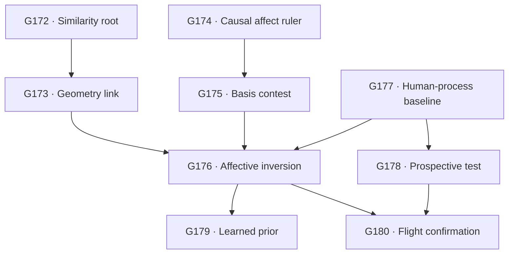

# Sounding Line Phase 2.4: Shared-Architecture Inversion and Affective-Prior Engineering

**Status:** Coding-agent work package; theory-facing, implementation-ready

**Curator:** Abraham Haskins

**Prepared:** 2026-08-22

**Repository snapshot inspected:** `a0ef40206f8e875100fae8bc0aee1e6326034dba` (`main`, synchronized with `origin/main`)

**Phase relationship:** Phase 2.4 follows the completed Phase 2.3 Stage-1 root map. It tests whether a reader's similarity to a maker, and a deliberately strengthened affective representation in that reader, improve bounded recovery of independently recorded process facts.

**Canonical repository destination if accepted:** `docs/design/PHASE_2_4_CONTEXT.md`

**Artifact status:** This is a design context, not a theory document. Do not alter the five living theory files merely to make them agree with it.

---

## 0. Executive decision

There is enough theoretical specification to begin. Another curator-question pass is not required before the cheap roots.

The new proposal is technically coherent, but its claim must be split into three levels:

1. **Shared-model inversion:** a reader with a generative geometry closer to the maker may recover the maker's recorded prompt, goal, or route more accurately.
2. **Engineered affective constraint:** an affect-related subspace in an open-weight reader may be amplified, ablated, aligned, or trained with PyTorch, and that intervention may improve process inversion.
3. **Human mechanism:** a result in transformers may be an engineered analogue of the proposed human shortcut. It does not establish that the transformer duplicated a limbic system, a midbrain, embodied simulation, or human empathy.

Phase 2.4 tests the first two. It installs a later human-reader anchor for the third.

The central question is:

> **Does similarity between maker and reader make the maker's process easier to invert, and can a human-derived affective prior causally improve that inversion on independently recorded human choices beyond surface, semantic, and generic-steering controls?**

The sought result is the curator's “flight” result: a large, replicated, causal, selective improvement that appears where the theory predicts and survives the obvious ways an activation intervention can cheat. This is an engineering target, not permission to convert a working intervention into a biological claim.

Phase 2.4 is **not**:

- a human-versus-AI detector;
- a binary authorship adjudication set;
- a new component-count study;
- an attempt to infer values wholesale;
- a claim that a model has emotions or subjective experience;
- a claim that the seven Panksepp systems or 27 reportable emotion categories are transformer neurons, principal components, or anatomical homologues;
- a prompt search whose winner is whatever makes the model most confident.

---

## 1. The theoretical correction Phase 2.4 operationalizes

### 1.1 Human invertibility is not currently measured

The Phase 2.3 reader results measure **model-reader invertibility**. They show what the selected language-model readers can recover from artifacts and records. They do not show what a human can recover, because the tested reader has no human sensorimotor body, no human affective control machinery, and no direct equivalent of the reader's lived expertise.

The project should therefore reserve these terms:

- **model invertibility:** recovery by a specified model reader;
- **human invertibility:** recovery by specified human readers under stated context and expertise;
- **engineered human-shaped invertibility:** recovery by a model reader given an intervention derived from human-labelled or human-theorized structure.

The third is the Phase 2.4 target. It is a bridge hypothesis, not a synonym for the second.

### 1.2 The shared-architecture shortcut

The curator's proposed mechanism is not that self-reconstruction is intrinsically optimal. A reader begins with its own generative possibilities because those are available, then adjusts toward the maker using evidence and context. Similarity makes this shortcut cheaper and less wrong.

Let:

- (O) be the observed artifact;
- (C) be declared context;
- (P^\star) be the externally recorded process or process class;
- (R) be the reader;
- (M) be the maker;
- (K_R) be the reader's expertise and available generative model;
- (A_R) be the reader's affective constraint or engineered affective prior.

The operational object is:

\[
q_R(P \mid O,C,K_R,A_R).
\]

The similarity hypothesis predicts that, other things equal, recovery improves as the maker's generative organization becomes more usable by the reader. In Phase 2.4, model family, checkpoint lineage, training relation, and representational alignment are tractable analogues of that relation. None is assumed to be the human relation itself.

### 1.3 The affective constraint is a deformation, not an answer key

The proposed human advantage is a constrained possibility space: evolutionarily supplied affective/action-control structure narrows the processes a human reader must consider. The corresponding model intervention must therefore alter the reader's **trajectory landscape**, not supply a true label in prose.

Phase 2.4 will test two causal operations on an affective subspace (U_{A,l}) at transformer block (l):

\[
h'_{l}=h_l+\alpha U_{A,l}U_{A,l}^{\top}(h_l-\mu_l)
\]

for amplification, and

\[
h'_{l}=h_l-\beta U_{A,l}U_{A,l}^{\top}(h_l-\mu_l)
\]

for ablation.

This amplifies or removes the affective component already present in the reader's state. It does not inject “fear” or another answer selected from the ground truth. A later low-rank adapter may learn a human-labelled affective geometry, but it must be trained without process labels and compared with equal-capacity non-affective adapters.

### 1.4 Embodied simulation and mirror systems set a later boundary

The mirror-neuron and embodied-simulation literature motivates the general idea that an observer can reuse its own action organization to constrain interpretation. It does not establish a magical channel by which one mind directly receives another's state. The defensible core is narrower: observed action can recruit compatible motor representations, while richer mental-state inference also depends on context, target expression, and cognitive inference.

Phase 2.4 therefore treats “mirror” as a **shared-generative-organization hypothesis**, not as a feature name. The present text experiments do not contain enough sensorimotor information to claim a mirror-neuron analogue. A visual or action-production phase may test that later.

### 1.5 The visual map remains binding

The intervention should be interpreted against `docs/assets/visual-map.png`:

- affective structure and expertise deform which trajectories are reachable and cheap;
- focal goals temporarily promote regions of that space;
- behavior samples a candidate at the surface;
- a reader attempts to reconstruct a useful landscape from the resulting trace.

The intervention is successful only if it improves that reconstruction on facts not used to build the intervention. Merely making emotional language more likely is not success.

---

## 2. Research-informed boundaries

### 2.1 What is technically available now

Recent work makes the proposed intervention technically ordinary, even though its interpretation remains difficult.

| Research result | What it licenses here | What it does not license |
|---|---|---|
| [Representation Engineering](https://arxiv.org/abs/2310.01405) and [Contrastive Activation Addition](https://aclanthology.org/2024.acl-long.828/) identify and manipulate population-level directions in language-model activations. | Fit contrastive directions, inspect them across blocks, and intervene during a forward pass. | Treating a steerable direction as a unique or biologically equivalent mechanism. |
| [Inference-Time Intervention](https://proceedings.neurips.cc/paper_files/paper/2023/hash/81b8390039b7302c909cb769f8b6cd93-Abstract-Conference.html) changes model behavior by shifting selected activation directions. | A causal intervention can be lightweight and evaluated through downstream behavior. | Assuming an accuracy gain has no capability, calibration, or helpfulness tradeoff. |
| [Emotion Concepts and their Function in a Large Language Model](https://arxiv.org/abs/2604.07729) reports abstract emotion representations in Claude Sonnet 4.5 that generalize across contexts and causally influence preferences and behavior. | Reproduce a bounded version in open-weight models, then ask whether the features causally support inversion. | Subjective emotion, human neural homology, or transfer from one proprietary model by assertion. |
| [Locating and Editing Factual Associations in GPT](https://proceedings.neurips.cc/paper_files/paper/2022/hash/6f1d43d5a82a37e89b0665b33bf3a182-Abstract-Conference.html) uses causal interventions rather than probe accuracy alone. | Require patching, ablation, or steering after a decoding result. | Calling a linearly decodable correlate a mechanism. |
| [On the Identifiability of Steering Vectors](https://arxiv.org/abs/2602.06801) shows large equivalence classes of behaviorally similar interventions unless added structure is imposed. | Use sparsity, cross-environment validation, cross-block consistency, and multiple bases; report non-uniqueness. | Naming one successful vector “the” affective mechanism. |
| Recent steering studies report broad off-target effects, including [emergent misalignment](https://arxiv.org/abs/2606.08682). | Include unrelated-behavior, capability, refusal, fabrication, and calibration audits at every strength. | Treating strong behavioral movement as precision. |

PyTorch is the intervention substrate, not the theory. Module-specific forward hooks can capture or modify block outputs; the [PyTorch `Module` documentation](https://docs.pytorch.org/docs/stable/generated/torch.nn.Module.html) supplies the supported mechanism. Do not use a global module hook as the production interface.

### 2.2 Similar models can share usable geometry

[Centered kernel alignment](https://proceedings.mlr.press/v97/kornblith19a.html) provides a way to compare representations between trained networks. The repository has already used CKA and found that its late-stage alignment survives a correspondence-breaking null more consistently than its early alignment. Raw CKA magnitude at small sample-to-dimension ratios is not interpretable in this repository; only null-tested match structure currently carries weight.

[Cross-model transfer work](https://aclanthology.org/2025.acl-long.185/) shows that linear maps learned on paired representations can transfer concept directions between language models. [The Platonic Representation Hypothesis](https://proceedings.mlr.press/v235/huh24a.html) collects broader evidence of representational convergence, while explicitly retaining limitations and counterexamples.

This supports a test of shared geometry. It does not guarantee that same-family readers invert same-family makers better. That behavioral interaction must be measured directly.

Recent prompt-inversion work supplies a useful adjacent benchmark. [Output-to-prompt inversion](https://aclanthology.org/2024.emnlp-main.819/) and the 2026 [Previous-Token Prediction method](https://arxiv.org/abs/2607.29378) recover prompts from outputs under different access conditions. Phase 2.4 may use these as baselines or later branches, but exact prompt recovery from a model's output is not the same construct as recovering a human maker's process.

### 2.3 Seven, 27, and PCA are three different claims

The phase must preserve this distinction:

1. Panksepp's seven primary-process systems—SEEKING, RAGE, FEAR, LUST, CARE, PANIC/GRIEF, and PLAY—are a cross-species affective-neuroscience framework supported through stimulation, lesion, pharmacological, and behavioral evidence; see the [Panksepp review](https://pmc.ncbi.nlm.nih.gov/articles/PMC3181986/). They were not discovered as seven orthogonal principal components.
2. Cowen and Keltner's [27 categories](https://www.pnas.org/doi/10.1073/pnas.1702247114) are varieties of **self-reported emotional experience** elicited by videos and connected by continuous gradients. They are not 27 established subcortical channels and not a 27-component neural PCA result.
3. [GoEmotions](https://aclanthology.org/2020.acl-main.372/) is a language dataset with 58,000 Reddit comments labelled for 27 emotion categories plus neutral. Its 27-label taxonomy is useful for fitting linguistic affect representations, but it is not interchangeable with Cowen and Keltner's stimulus taxonomy.

The repository's own affect-component counter is void. Phase 2.4 must not repair it under a new name. It uses named bases as competing interventions and compares each with rank-, norm-, and parameter-matched controls. It does not infer the correct number of human affective primitives.

### 2.4 Human process records exist, but they differ in evidential strength

- [CoAuthor](https://dl.acm.org/doi/10.1145/3491102.3502030) records 1,445 human–GPT-3 writing sessions from 63 writers, including suggestions and observable accept/reject/edit behavior. Those actions are behavioral ground truth; latent rationale is not.
- [ScholaWrite](https://aclanthology.org/2026.acl-long.1606/) records about 61,500 edits across five scholarly projects and supplies a 15-class writing-intention annotation. The repository has already shown that its public split leaks heavily across projects. All Phase 2.4 use must be leave-one-project-out. The annotations are a useful process proxy, not direct access to every writer's mental state.
- The existing ArgRewrite and G159 materials contain recorded revision instructions and verified realization. They remain the cleanest local bounded-choice targets.

The phase should prefer objective actions and assigned conditions over retrospective rationales. Model chain-of-thought is never ground truth.

### 2.5 The resulting research conclusion

The proposal is worth testing now. The strongest version that current research licenses is:

> Language models contain affect-related representations that can sometimes be intervened on causally; different models can share alignable concept geometry; and process records permit held-out tests of whether such an intervention improves inversion.

The unsupported shortcut is:

> Therefore a PyTorch bias recreates the human midbrain and measures human invertibility.

Phase 2.4 is designed so that the first can succeed without silently asserting the second.

---

## 3. Empirical starting point from the live repository

The coding agent must begin from these settled results rather than restarting the theory:

| Existing result | Binding consequence for Phase 2.4 |
|---|---|
| Phase 2.3 W4 won three constructions: route, ratification, and handling-free contribution were records-readable and artifact-blind. | Historical process may remain underdetermined. Every artifact-only result keeps a process-aware ceiling and permits abstention. |
| G159 recovers realized executed choices from final artifacts at 0.86 versus 0.22 on twins, and the echo-wrong decomposition preserves the result. | Realized semantic consequences are a valid positive target. Use this before attempting richer latent-process claims. |
| G166 route recovery is semantically blind (0.07 committed-correct), while a five-feature surface block reaches 0.48 and the process-aware ceiling reaches 0.78. | Family inversion must beat surface fingerprinting and may still end in a records-only boundary. |
| G167 shows that supplied context acts as an override with no reliable truth discount. | The affective prior must be an internal intervention, not a prose card that states or suggests the answer. False-context and fabrication gates remain standing. |
| G169 finds long-form handling density at 0.77, with zero span localization and 0.40 clean fabrication. | Classification without localization is not evidential access. Phase 2.4 must score fabrication and evidence localization separately. |
| G171 validates integration/adoption while forcing origin abstention. | Later handling may be identifiable when origin is not. Do not convert successful inversion into provenance. |
| G40 finds coherent affect geometry in all eleven checked families; G42/G43 reject the proposed depth bands and the affect-specific early boundary. | Work with subspaces and null-tested aligned stages, not “early/mid/late brain regions in transformer blocks.” |
| G124 supports late CKA alignment more strongly than early alignment. | Reuse the alignment machinery, but preserve its permutation null and small-(n), high-dimensional caveat. |
| The affect-dimension studies are void and the counting instrument is multiply defective. | No new component count. Seven, 27, and VAD enter only as fixed competitor bases. |
| `THREE_COGNITIVE_LAYERS.md` G45 is open and already names the causal gate before controllability. | Phase 2.4 is the authorized build of that gate: causal relevance first, controllability second, seeding or relocation last. |

Read before implementation:

1. `docs/design/archive/PHASE_2_3_ROOT_MAP.md`;
2. `docs/design/archive/PHASE_2_3_REGISTRY.md`;
3. the five living files in `docs/theory/`, newest state first;
4. `docs/method/NEURAL_ANALOGUES.md`, `docs/method/CONTROLS.md`, and `docs/method/LESSONS.md`;
5. `docs/assets/visual-map.png` directly;
6. the folded entries for G40, G124, G159, G166, G167, G169, and G171 in `FINDINGS.md` and `docs/STATE.md`;
7. the current activation, CKA, and process-reader runners before creating replacements.

---

## 4. Claim ladder

Every Phase 2.4 result is assigned the highest rung it actually reaches.

| Rung | Claim | Minimum evidence |
|---|---|---|
| **0. Direction exists** | A contrast produces a repeatable activation direction or subspace. | Held-out discrimination, shuffled-label null, prompt/template stability. |
| **1. Direction generalizes** | The representation tracks the concept outside explicit label words or one actor/context. | Lexically scrubbed situations, topic transfer, actor transfer, second seed/model. |
| **2. Direction is causally used** | Removing or adding it changes a specified behavior selectively. | Intervention, dose curve, random/generic controls, capability audit. |
| **3. Direction supports inversion** | The intervention improves recovery of independently recorded process facts. | Proper-score gain on untouched cases, calibration, cheap-feature and false-context gates. |
| **4. Human-shaped selectivity** | The gain is stronger for human-process targets than matched model-process targets and survives surface controls. | Predeclared creator-type interaction across at least two datasets and two reader families. |
| **5. Human-invertibility evidence** | Human readers show the corresponding bounded advantage, and the model intervention predicts or approaches that pattern. | A preregistered human-reader study with known-answer process cases and declared expertise/context. |

A probe result may not be called mechanistic. A steering result may not be called inversion. A human-process result may not be called a human neural mechanism. The package is successful if it cleanly reaches any rung and names where it stops.

---

## 5. Rival worlds

These worlds can combine; the phase should report a probability movement over them rather than select one total ontology.

| World | Description | Characteristic result |
|---|---|---|
| **W-A: shared-geometry inversion** | Similar maker and reader generative organizations make the true process easier to recover. | Same-family or representation-aligned pairs improve proper scores after capacity and surface controls; the effect tracks alignment rather than labels alone. |
| **W-B: family fingerprint** | Readers exploit surface dialect, tokenizer residue, or familiar generation quirks. | Same-family advantage collapses after paraphrase, style balancing, unconditional-likelihood subtraction, or a cheap surface block. |
| **W-C: convergent semantic space** | Models share enough high-level geometry that family relation adds little. | Cross-family readers and mapped directions work similarly; capacity or generic semantics predicts performance better than lineage. |
| **W-D: affective constraint** | Affect-related geometry causally narrows process hypotheses in a useful way. | Affect amplification improves and ablation harms held-out inversion; matched generic and random subspaces do not; effects are strongest on human-process targets without explicit affect words. |
| **W-E: generic representation engineering** | Any coherent semantic intervention changes the readout. | Affect, topic, syntax, persona, and random learned bases help similarly after rank and norm matching. |
| **W-F: confidence injection** | Steering changes commitment, wording, or note-following rather than truth. | Confidence rises while Brier/log score, fabrication, selective risk, or exact-equivalence behavior worsens. |
| **W-G: artifact underdetermination** | The relevant history is absent from final artifacts even with a better reader. | Process-aware and prospective tasks pass; artifact-only route or control remains at its floor. |
| **W-H: current instrument failure** | The concept ruler, intervention harness, or task cannot measure the proposed effect. | Known-answer, lexical-scrub, causal, or process-aware ceiling fails before natural results are interpretable. |

---

## 6. Program topology

The phase has three cheap roots. All expensive work is conditional.



Cheap Stage-1 roots:

- **G172:** does maker–reader similarity predict process inversion at all?
- **G174:** can the causal emotion-concept result be reproduced in an open-weight model under honest controls?
- **G177:** what artifact-only and prospective baselines are achievable on real human process records before intervention?

Stage 1 ends with a theory-facing root map and a curator pause. Do not automatically execute every open branch.

---

## 7. Shared substrate

### 7.1 External ground truth only

Admissible targets:

- assigned prompt or goal;
- recorded revision instruction;
- recorded route family;
- suggestion offered, accepted, rejected, edited, retained, or removed;
- version-control operation;
- objectively logged later choice;
- experimenter-planted affective situation or benign preference outcome.

Not admissible as truth:

- generated rationale;
- hidden chain-of-thought;
- reader explanation;
- analyst interpretation of what the maker “must have meant”;
- model self-report of its internal process;
- token share as decision weight.

### 7.2 Interfaces stay separate

1. **Artifact-only:** final artifact and the candidate set.
2. **Paired-delta:** before/after, proposal/selection, or draft/revision pair.
3. **Prospective:** the artifact state immediately before a logged decision, with the future withheld.
4. **Process-aware:** the permitted log or event record.

Results are never pooled across interfaces. The prospective interface is especially important: it prevents a reader from explaining a completed choice after seeing its consequence.

### 7.3 The primary non-generative inversion score

The common reader should not require fluent explanation. For a candidate process description (p_i), score how well reader (R) predicts artifact (O):

\[
s_R(p_i,O)=\frac{1}{|O|}\left[\log P_R(O\mid p_i)-\log P_R(O\mid p_0)\right],
\]

where (p_0) is a neutral, candidate-independent conditioning string. Softmax the candidate scores only after temperature calibration on development data. This produces a process posterior without asking a base model to follow instructions or narrate a mind.

Required companion arms:

- direct prompted reader where instruction-following models are available;
- context-only candidate prior;
- unconditional and neutral-conditioned likelihood;
- strongest cheap lexical/style/change block;
- process-aware ceiling;
- exact-equivalence and no-signal cases;
- optional output-to-prompt or PTP inverse baseline only after the root matrix stands.

### 7.4 Model matrix

Stage 0 inventories locally available open-weight checkpoints before freezing the matrix. Prefer at least two families with two related checkpoints each, with a third family if the queue cost is ordinary. Reuse currently supported families where possible:

- Qwen 2.5 family;
- Pythia family;
- GPT-2 family;
- SmolLM2 family.

The final matrix must distinguish:

- exact checkpoint as maker and reader;
- same family, different size/checkpoint;
- different family, roughly capacity matched;
- different family, stronger reader;
- base versus instruction-tuned when both are available.

Do not compare raw log-likelihood across tokenizers. Compare within-reader candidate rank, log score, Brier score, calibration, and paired deltas.

### 7.5 Splits

- no artifact lineage crosses train, development, and test;
- no topic or prompt template crosses the held-out confirmation boundary;
- ScholaWrite is leave-one-project-out, never the shipped row split;
- intervention strengths and block choices are selected on development data only;
- basis-fitting texts never appear in an inversion target;
- cross-model alignment is fit on a shared neutral corpus and tested on disjoint concepts and texts;
- all paraphrases and variants of one artifact stay in one split;
- confirmation uses a fresh seed and, where possible, a fresh maker checkpoint.

### 7.6 Metrics

Primary:

- multiclass log score or Brier score on the recorded process class;
- paired change from unmodified reader to intervention;
- selective risk–coverage and abstention;
- the creator-type interaction:

\[
\Delta_{H-M}=(\text{intervened}-\text{base})_{human}-(\text{intervened}-\text{base})_{model}.
\]

Secondary:

- top-(k) coverage of the correct equivalence class;
- expected calibration error with disclosed binning;
- false-context susceptibility;
- clean-case fabrication;
- exact-equivalence divergence;
- performance on low-explicit-affect versus high-explicit-affect slices;
- evidence localization, separately from classification;
- general language-model and unrelated-task change under intervention.

Accuracy alone is insufficient. A steer that makes the reader answer more often can raise accuracy while worsening epistemic behavior.

### 7.7 Standing controls

Every root carries:

1. known-answer ruler;
2. no-signal and exact-equivalence cases;
3. context-only floor;
4. cheap surface baseline;
5. label-shuffle null;
6. dimension-, rank-, and norm-matched random subspace;
7. dimension-matched non-affective semantic subspace;
8. false-context arm;
9. fabrication and abstention audit;
10. at least one held-out family or domain;
11. multiplicity ledger;
12. frozen null, alternative, failure direction, and exhaustive verdict bands before scoring.

---

## 8. Mechanistic implementation boundary

### 8.1 Reuse before rebuilding

The repository already has:

- `soundingline/probe/activations.py`;
- `runners/run_cka_alignment.py` and its null;
- affect-direction and dimensionality runners;
- current Torch and Transformers pins in `requirements-lock.txt`;
- queue, manifest, preregistration, and result-ledger conventions.

Build the minimum new interface around these. Do not fork a second activation stack unless the current abstraction cannot safely modify block outputs.

### 8.2 New intervention interface

Create one architecture-normalized reader interface, tentatively:

- `soundingline/probe/conditional_reader.py` for candidate conditional likelihood;
- `soundingline/probe/interventions.py` for capture, projection, amplification, ablation, patching, and cleanup;
- an adapter registry that locates transformer blocks per supported family;
- unit tests confirming the hook is installed on the intended block, changes only the requested token positions, preserves tensor shape/dtype/device, and is removed after each call.

Use module-specific hooks or an equally explicit wrapper. Never leave a hook active between arms. Hash the model, tokenizer, basis, block map, and intervention configuration in every result.

### 8.3 Token boundary

For conditional-likelihood inversion, the intervention begins at the first artifact token, not while reading the candidate process description. Otherwise a candidate containing affect-related words could directly select its own intervention response. Record the exact token boundary and test it.

### 8.4 Basis construction

For each model and candidate block:

1. collect activations on balanced contrast sets across many topics and templates;
2. standardize using training-set statistics only;
3. compute difference-in-means directions or the paper-matched extraction method;
4. retain raw named directions for interpretation;
5. use QR/SVD only to obtain a stable projector onto their span;
6. report empirical rank and collinearity without interpreting the rank as the number of human emotions;
7. validate on lexically scrubbed, actor-shifted, and topic-held-out examples;
8. freeze the basis before process tasks are read.

Every substantive basis gets its own same-rank generic semantic and random controls. A 27-direction basis does not compete fairly with a two-direction basis merely by having more degrees of freedom.

### 8.5 Causal tests before “prior” language

The basis earns the name **causal affective representation** only if:

- held-out decoding passes;
- ablation changes the preregistered benign affect-sensitive behavior in the predicted direction;
- amplification produces the opposite movement over a bounded dose range;
- label-shuffled and random bases do not reproduce the effect;
- unrelated capabilities remain inside their frozen tolerance;
- the result repeats in a second model or is explicitly labelled model-specific.

Until then, call it a fitted affective basis.

---

## 9. Root and branch registry

### G172 / P24-S0 — creator–reader similarity matrix

**Question**

> Are outputs easier to invert when the reader is the exact maker model, a sibling checkpoint, or a representationally similar model family?

**Construction**

Build a balanced, process-recorded corpus from open-weight makers. For each topic, cross a small set of externally assigned goals or routes while holding task, length band, sampling policy, and output format fixed. Use candidate prompts whose lexical content is matched and whose consequences are independently verified in the artifact.

The minimum matrix is two model families by two checkpoints/sizes. The preferred matrix adds a third family. Each artifact is read by every reader with the same candidate set.

**Primary read**

- conditional-likelihood process posterior;
- correct-candidate log score and Brier score;
- within-reader exact-maker, same-family-sibling, and cross-family differences;
- capacity-adjusted maker–reader interaction.

**Principal controls**

- family/style classifier on the artifact;
- paraphrased or neutralized artifact arm;
- unconditional-likelihood subtraction;
- tokenizer-overlap and output-length covariates;
- random candidate labels;
- exact-equivalence copies;
- G166 five-feature surface block where applicable.

**Routing**

| Result | Interpretation | Next action |
|---|---|---|
| Exact and sibling readers win after surface and capacity controls | Candidate shared-organization effect | Open G173 and a fresh-family replication. |
| Exact wins; sibling does not | Target-distribution memorability or checkpoint fingerprint | One paraphrase/trace-erasure discriminator; do not claim shared family geometry. |
| Same-family effect collapses under surface control | W-B family fingerprint | Close the similarity mechanism; retain the best surface instrument as baseline. |
| Strong readers win regardless of family | Capacity or convergent semantics | Open a capacity-matched G173 analysis only. |
| No reader beats the floor with ceiling passed | Artifact underdetermination | Stop artifact-only route expansion; preserve prospective/process-aware branches. |

**Licensed claim**

“Model-process inversion changes with maker–reader relation under this construction.” Never “similar people understand each other better” from this root alone.

### G173 / P24-S1 — representation–inversion linkage

**Dependency:** G172 produces a nontrivial pairwise pattern.

**Question**

> Does measured representational alignment explain which readers invert which makers, beyond family labels and surface fingerprints?

**Method**

- reuse null-tested CKA match structure on a much larger shared neutral corpus;
- add an orthogonal-Procrustes or ridge alignment diagnostic;
- fit cross-model linear maps on training texts only;
- test map generalization on disjoint concepts and artifacts;
- relate pairwise alignment to G172 proper-score performance using a model-pair analysis that controls capacity, tokenizer family, base/instruct status, and surface-classifier confidence.

Correlation is not the endpoint. If a direction from maker (M) can be mapped into reader (R), ablate or transplant it and test whether the specific inversion score moves. This is the causal branch.

**Routing**

- alignment predicts inversion and causal transfer works → W-A gains probability;
- alignment predicts inversion but intervention fails → descriptive shared geometry only;
- family label predicts after alignment does not → training/style lineage or poor similarity metric;
- raw CKA alone predicts → run its correspondence-breaking null before interpretation;
- no relation → close geometry-mediated interpretation; G174 may continue independently.

### G174 / P24-A0 — open-weight causal emotion-concept ruler

**Question**

> Can an open-weight reader reproduce a bounded version of the reported emotion-concept result: abstract, cross-context decoding plus causal behavioral influence?

**Construction**

Fit directions from explicit emotion examples, then test on:

- situations with emotion words removed;
- the emotion attributed to speaker, interlocutor, or third person;
- matched topics carrying different affective situations;
- matched affective situations expressed in different registers;
- neutral and ambiguous cases requiring abstention.

Use benign downstream outcomes only: continuation preference, interpretation of a harmless social situation, or choice among matched response strategies. Do not reproduce blackmail, self-preservation, or harmful-behavior demonstrations merely because the paper did.

**Gates**

- held-out decoding above the frozen effect band and above a lexical baseline;
- actor and topic transfer;
- amplification/ablation sign pair;
- random, shuffled-label, and generic semantic directions quiet;
- no broad capability or calibration collapse;
- second-seed replication.

**Routing**

- decoding and causal gates pass → open G175;
- decoding passes, intervention fails → representation without established causal use; one block/strength repair, then stop;
- only explicit-word cases pass → lexical affect feature, not abstract ruler;
- random/generic controls move equally → generic steering; do not open G175;
- all gates fail → instrument failure, not evidence against the human theory.

### G175 / P24-A1 — competing affective bases

**Dependency:** G174 establishes a causal open-weight ruler.

**Question**

> Which, if any, fixed human-derived affective basis supplies a stable and selective intervention substrate?

**Bases**

1. **Panksepp-7 semantic basis:** seven named systems, treated as correlated theory directions rather than orthogonal discovered components.
2. **GoEmotions-27 text basis:** human-labelled linguistic categories, explicitly distinct from Cowen–Keltner's 27 experience categories.
3. **Cowen–Keltner geometry target:** only if the public ratings/stimuli can be used with intact provenance; treat it as reported-experience geometry, not neural components.
4. **VAD basis:** valence and arousal, optionally dominance as a separately declared third dimension.
5. **Human-labelled versus model-synthetic twin:** same label set and extraction recipe, differing only in the source of examples or labels.
6. **Dimension-matched generic semantic basis.**
7. **Dimension-matched random orthogonal basis.**
8. **Label-shuffled basis.**

**Comparison discipline**

- compare each substantive basis against controls with the same empirical rank and intervention norm;
- freeze blocks and strengths on development data;
- report basis stability across templates, seeds, blocks, and models;
- do not select the winner on the later process-inversion test;
- do not announce a “number of emotions.”

**Routing**

- one human-derived basis is stable and selectively causal → freeze it for G176;
- all affect bases work similarly → use the smallest stable span and describe generic affective geometry;
- semantic controls work equally → W-E; close the human-affect-specific route;
- human-labelled and synthetic twins are indistinguishable → no evidence that human annotation supplied the advantage;
- no basis survives → stop intervention wing after documenting the ruler.

### G176 / P24-A2 — causal affective prior for process inversion

**Dependencies:** G174 passes; G175 supplies a frozen basis; G177 supplies human-process baselines. G173 is helpful but not mandatory.

**Question**

> Does amplifying an affective subspace, or ablating it, causally change recovery of recorded goals and process choices?

**Arms**

For each frozen reader and task:

1. no intervention;
2. affect amplification at preregistered strengths;
3. affect ablation;
4. same-rank generic semantic amplification/ablation;
5. same-rank random amplification/ablation;
6. shuffled-label affect basis;
7. prompt-only affect instruction, isolated as a context-following comparison;
8. process-aware ceiling.

Intervene only on artifact tokens. Score model-process, human-process, low-explicit-affect, and high-explicit-affect slices separately.

**Primary result**

The result is not the best arm. It is the preregistered pattern:

- amplification improves proper score;
- ablation worsens it;
- both effects are dose-bounded and selective;
- generic/random/shuffled controls do not reproduce them;
- the human-process effect exceeds the matched model-process effect;
- calibration, abstention, exact-equivalence, and fabrication remain inside their gates.

**Routing**

| Pattern | Meaning | Branch |
|---|---|---|
| Full sign pair and human-selective gain | Candidate affective-constraint result | Open G178, G179, and held-out G180. |
| Gain on human and model process equally | General reader enhancement | Replicate, but no human-shaped claim. |
| Gain only on explicit affect language | Emotion recognition, not process inversion | Close broad theory branch; retain narrow instrument result. |
| Confidence rises, truth does not | W-F confidence injection | Retire intervention at that strength/family. |
| Random or semantic basis matches affect | Generic activation manipulation | Close affect-specific interpretation. |
| Ablation harms all tasks broadly | Capability lesion | Instrument failure; reduce strength or localize once, then stop. |
| Artifact-only stays null; prospective/process-aware improves | W-G boundary | Product remains audit/prospective, not historical inference. |

### G177 / P24-H0 — natural human-process baselines

**Question**

> Before intervention, which recorded human process facts are recoverable at artifact-only, paired-delta, and prospective interfaces?

**Corpora**

- G159/ArgRewrite realized revision instructions as the local positive anchor;
- CoAuthor observable suggestion and editing actions;
- ScholaWrite intention annotations under leave-one-project-out evaluation;
- a small no-signal/exact-equivalence construction using existing records.

**Targets**

For CoAuthor, prefer objective behavior:

- accept versus reject a presented suggestion;
- accepted unchanged versus edited before retention;
- retained versus later deleted;
- next request or revision action when observable.

Do not treat the final percentage of human-written tokens as decision contribution.

For ScholaWrite, describe the target as **annotated writing-intention class**, not the writer's verified internal goal. Reuse the repository's reproduced baselines and leak audit.

**Routing**

- artifact-only positive beyond cheap features → eligible G176 target;
- prospective positive, artifact-only null → ideal anti-projection target for G178;
- process-aware only → audit boundary, still useful as a ceiling;
- all interfaces fail their ceilings → corpus or target failure, not a theoretical null.

### G178 / P24-H1 — prospective anti-projection test

**Dependency:** G177 identifies a viable prospective target; G176 may run before or after its unmodified baseline.

**Question**

> Does the reader's inferred maker model predict a future choice that was not available when the inference was formed?

**Construction**

At time (t), give the reader only the artifact state, allowed context, and candidate future actions. Withhold the action at (t+1), later repair, later retention, or next revision intention. Compare:

- artifact/draft-only reader;
- draft plus frozen affective intervention;
- recent-action Markov baseline;
- author/project-frequency baseline;
- lexical/change-feature baseline;
- process-aware ceiling.

Split by author or project. A future event from the same session may not enter training through a sibling window.

**Meaning**

Prospective success is stronger than a completed-artifact rationale because the consequence cannot be used to explain itself. It still establishes behavioral prediction, not direct access to a hidden mental state.

### G179 / P24-A3 — learned affective-prior adapter

**Dependency:** G176 produces a robust causal gain. Do not build this to rescue a null linear intervention.

**Question**

> Can a small learned deformation of the reader's possibility space preserve the G176 gain more reliably than hand-set activation scaling?

**Construction**

Train a low-rank adapter or constrained linear operator using only affective examples or a human affective similarity geometry. No process label, author label, provenance label, or G176 test artifact may enter training.

Compare with:

- equal-parameter generic semantic adapter;
- equal-parameter random-label adapter;
- ordinary task adapter trained on the same number of examples;
- frozen linear G176 intervention;
- unmodified reader.

The adapter must be regularized toward a small intervention and audited for general capability, calibration, off-target personality change, refusal behavior, and fabrication.

**Licensed claim**

“A human-labelled affective auxiliary objective improved bounded process inversion.” Not “the model acquired drives,” “the model became empathic,” or “the model's values aligned.”

### G180 / P24-X0 — flight confirmation and human-reader anchor

**Dependency:** G176 is positive on untouched data or G178 supplies a strong prospective effect.

**Part A: adversarial confirmation**

Repeat the frozen intervention on:

- a second reader family;
- a fresh maker checkpoint;
- a second human-process corpus;
- paraphrased and professionally flattened artifacts;
- low-effort human artifacts;
- high-polish model artifacts;
- artifacts with deliberately planted emotional language unrelated to the true process;
- artifacts with the same process but different expressed affect;
- exact-equivalence and false-context cases.

The intervention must not become a detector for emotional vocabulary or polished style.

**Part B: bounded human-reader study**

Prepare—but do not recruit or launch without the curator's human-subjects decision—a blinded packet in which human readers infer assigned goals or observable process actions from the same candidate sets. Record:

- reader expertise and familiarity with the domain;
- available context;
- confidence and abstention;
- self-authored/familiar versus unfamiliar items where ethically and practically possible;
- exact known answers from assigned conditions or logs.

If publication or generalizable human-subject claims are intended, resolve the applicable ethics/IRB requirements before collection.

The human anchor asks whether reader familiarity/expertise and human performance show the qualitative structure the engineered model result predicts. It is not required to validate an engineering tool, but it is required before calling the tool evidence about **human invertibility**.

---

## 10. The “flight” standard

Do not choose a numerical threshold after seeing the pilot. Stage 0 derives detectable-effect and precision bands from current baselines and feasible sample counts. The qualitative standard is fixed now.

A **Phase 2.4 engineering flight result** must be:

1. **causal:** amplification and ablation move inversion in the predicted opposite directions;
2. **controlled:** same-rank random, shuffled, and non-affective semantic interventions do not explain it;
3. **truth-improving:** proper score and calibration improve, not merely answer rate or confidence;
4. **selective:** the effect is largest on the declared human-process target or low-explicit-affect slice, not on every task indiscriminately;
5. **replicated:** at least two reader families and two process substrates, one natural;
6. **held out:** block, basis, strength, thresholds, and adapters are frozen before the confirmation set;
7. **robust:** false-context, surface, exact-equivalence, fabrication, and mild paraphrase gates stay quiet;
8. **large enough to matter:** the interval excludes both zero and the preregistered smallest useful effect.

A flight result licenses:

> “A constrained affect-related intervention materially improved bounded recovery of recorded human process choices.”

It does not license:

> “We recreated the human midbrain,” “we measured soul,” “we detected human authorship,” or “we extracted human values.”

If the effect is surprising, large, and reproducible, stop expanding the tree and confirm it. If every effect is small, basis-sensitive, or confidence-only, the phase has found no lift and should return to theory or a different instrument family.

---

## 11. Execution order

### Stage 0 — reconcile and build the spine

1. Resolve current `origin/main`; do not revert later work to this snapshot.
2. Allocate G172–G180 only after confirming they remain unused.
3. Create `docs/design/PHASE_2_4_REGISTRY.md` with every root and predeclared route.
4. Inventory local models, weights, VRAM, cached corpora, and licensing.
5. Add conditional-likelihood and intervention interfaces with unit tests.
6. Write a dependency table showing which corpora and results can be reused.
7. Build exact-equivalence, hook-cleanup, token-boundary, dtype/device, and determinism tests.
8. Derive power/precision bands for the cheap roots.
9. Freeze G172, G174, and G177 cards before scoring their test data.

### Stage 1 — three cheap roots

Run:

1. G172 creator–reader similarity matrix;
2. G174 causal affect ruler on one open-weight family, with its predeclared second seed;
3. G177 human-process baseline import and interface map.

Cap new generation and GPU work to one ordinary local queue day. No paid API or cloud burst without existing approval rules.

Then write `docs/design/PHASE_2_4_ROOT_MAP.md` and pause for the curator.

### Stage 2 — mechanism branches only

Depending on the root map:

- G173 if maker–reader relation is nontrivial;
- G175 if the causal affect ruler passes;
- G178 if a prospective human-process target stands;
- G176 only when both a frozen affective basis and a valid process target exist.

### Stage 3 — one engineering branch

If G176 is positive, choose one:

- G179 learned prior, when the linear intervention is real but unstable;
- G180 direct held-out confirmation, when the linear intervention is already stable.

Do not build an adapter merely because it is technically interesting.

### Stage 4 — human anchor

Prepare the G180 human packet only after an engineering result identifies the exact question humans need to answer. Do not ask humans to adjudicate a vague theory or binary AI origin.

---

## 12. Branch discipline

### Positive roots

A root positive opens at most:

1. one mechanism discriminator;
2. one transfer;
3. one adversarial test.

At least one uses untouched data.

### Null roots

A null with a passed ruler and ceiling gets one predeclared repair for resolution, block location, or intervention strength. A second null stops that branch for Phase 2.4.

### Reversals

A reversal has priority over further optimization. Write the rival model in plain language and construct one case where it and the curator's model diverge.

### Instrument failures

Failed decoding, hook integrity, causal ruler, or process-aware ceiling means the natural result is uninterpretable. Repair once if the repair was named in advance; otherwise stop.

### Search discipline

The repository's broader engineering-loop principle still applies: widen candidate mechanisms before overfitting one. But G174–G176 are confirmatory enough that basis, block, and strength cannot be evolved on the test set. Any exploratory basis search uses a development archive and must earn a fresh confirmation.

---

## 13. Curator-facing reporting and cognitive-preemption guard

The coding agent's final report is not the curator's theory conversation.

### 13.1 First report after Stage 1

Before offering an interpretation or next-wave recommendation, provide a short **cold root map** containing only:

1. the result shape of each root in one sentence;
2. which rival worlds gained or lost probability;
3. the strongest rival explanation for the entire pattern;
4. three to five theory-level, open-ended questions;
5. which branches are technically open, without recommending one.

Questions must live at the level of theory. Individual-study mechanics appear only when they create a theory-scale ambiguity.

The curator then gives a verbal walkthrough. Only after that should the theoretical analyst synthesize, recommend, or draft the next package.

### 13.2 Question quality

Useful questions ask, for example:

- If similarity helps only at the exact checkpoint, is that a degenerate form of self-reconstruction or evidence against the shared-architecture account?
- If affect ablation harms prospective human-choice prediction but not artifact-only route recovery, does the proposed constraint belong to live modeling rather than historical reading?
- If a generic semantic subspace matches the affective one, what is left of the claim that the missing constraint is affective rather than broadly conceptual?
- If human-labelled and model-synthetic bases perform identically, was the useful structure already in language rather than supplied by human affective judgment?
- What pattern would justify treating a human-selective interaction as more than corpus mismatch?

Do not ask the curator to select a block, tune a learning rate, choose a classifier, or adjudicate a malformed label unless that choice changes the theory.

### 13.3 Result template

```text
## Where the theory moved
## What became less plausible
## Strongest rival account
## Open questions before interpretation
## Branches now technically available
## Mechanics appendix
```

The mechanics appendix carries samples, intervals, confusion matrices, manifests, deviations, and file pointers. It does not lead the conversation.

---

## 14. Documentation changes authorized by this package

Authorized after the package is accepted:

- add this file at `docs/design/PHASE_2_4_CONTEXT.md` without changing its substantive wording;
- add `docs/design/PHASE_2_4_REGISTRY.md`;
- add G172–G180 rows to `TODO.md` and the queue as they are actually frozen;
- add runners, tests, corpora manifests, preregistration cards, and result directories under existing conventions;
- point `docs/design/README.md` and `docs/STATE.md` to the current phase;
- add `docs/design/PHASE_2_4_ROOT_MAP.md` only after Stage 1 completes;
- update `docs/TOOLS.md`, `docs/method/LESSONS.md`, and the multiplicity ledger when the corresponding machinery or failure actually exists.

Not authorized:

- editing curator blockquotes;
- revising existing theory prose to make Phase 2.4 look pre-confirmed;
- reviving the affect-component count;
- silently changing G40, G124, or Phase 2.3 verdicts;
- adding a sixth living theory file;
- turning a result into a provenance score;
- rewriting old quotes because later language sounds cleaner.

After the Phase 2.4 root map and curator walkthrough, theory changes—if any—must arrive as a separate errata package with quoted source language, insertion points, and explicit curator approval.

---

## 15. Immediate coding-agent checklist

1. Copy this package to `docs/design/PHASE_2_4_CONTEXT.md`.
2. Reconcile it against the current default-branch head.
3. Confirm G172–G180 are free.
4. Read the required repository files in §3.
5. Write the Phase 2.4 dependency and model-inventory table.
6. Implement and test the conditional-likelihood reader.
7. Implement and test block-local capture/intervention with guaranteed cleanup.
8. Build the three Stage-1 preregistration cards.
9. Freeze their nulls, alternatives, failure directions, practical bands, and single repair.
10. Run G172, G174, and G177 only.
11. Produce the cold root map in the §13 format.
12. Stop for the curator's verbal walkthrough.

---

## 16. Primary research anchors

- Zou et al., [Representation Engineering: A Top-Down Approach to AI Transparency](https://arxiv.org/abs/2310.01405).
- Rimsky et al., [Steering Llama 2 via Contrastive Activation Addition](https://aclanthology.org/2024.acl-long.828/).
- Li et al., [Inference-Time Intervention: Eliciting Truthful Answers from a Language Model](https://proceedings.neurips.cc/paper_files/paper/2023/hash/81b8390039b7302c909cb769f8b6cd93-Abstract-Conference.html).
- Sofroniew et al., [Emotion Concepts and their Function in a Large Language Model](https://arxiv.org/abs/2604.07729).
- Meng et al., [Locating and Editing Factual Associations in GPT](https://proceedings.neurips.cc/paper_files/paper/2022/hash/6f1d43d5a82a37e89b0665b33bf3a182-Abstract-Conference.html).
- Venkatesh and Kurapath, [On the Identifiability of Steering Vectors in Large Language Models](https://arxiv.org/abs/2602.06801).
- Kornblith et al., [Similarity of Neural Network Representations Revisited](https://proceedings.mlr.press/v97/kornblith19a.html).
- Huang et al., [Cross-model Transferability among Large Language Models on the Platonic Representations of Concepts](https://aclanthology.org/2025.acl-long.185/).
- Huh et al., [The Platonic Representation Hypothesis](https://proceedings.mlr.press/v235/huh24a.html).
- Suhail et al., [Previous-Token Prediction Based LLM Inversion](https://arxiv.org/abs/2607.29378).
- Zhang, Morris, and Shmatikov, [Extracting Prompts by Inverting LLM Outputs](https://aclanthology.org/2024.emnlp-main.819/).
- Panksepp, [Affective Neuroscience of the Emotional BrainMind](https://pmc.ncbi.nlm.nih.gov/articles/PMC3181986/).
- Cowen and Keltner, [Self-report Captures 27 Distinct Categories of Emotion Bridged by Continuous Gradients](https://www.pnas.org/doi/10.1073/pnas.1702247114).
- Demszky et al., [GoEmotions: A Dataset of Fine-Grained Emotions](https://aclanthology.org/2020.acl-main.372/).
- Gallese and Goldman, [Mirror Neurons and the Simulation Theory of Mind-Reading](https://pubmed.ncbi.nlm.nih.gov/21227300/).
- Hickok, [Eight Problems for the Mirror Neuron Theory of Action Understanding](https://pmc.ncbi.nlm.nih.gov/articles/PMC2773693/).
- Shamay-Tsoory et al., [Two Systems for Empathy](https://pubmed.ncbi.nlm.nih.gov/18971202/).
- Lee, Liang, and Yang, [CoAuthor](https://dl.acm.org/doi/10.1145/3491102.3502030).
- Le et al., [ScholaWrite](https://aclanthology.org/2026.acl-long.1606/).
- PyTorch, [`torch.nn.Module` and module hooks](https://docs.pytorch.org/docs/stable/generated/torch.nn.Module.html).

---

## 17. One-sentence handoff

> Build a crossed maker–reader inversion matrix, reproduce a causal affective representation in open weights, establish real human-process baselines, and only then test whether a frozen human-derived affective subspace causally improves calibrated recovery of recorded choices beyond equal-capacity semantic and random interventions—pausing after the three cheap roots so the curator can interpret the theory before the tree advances.
